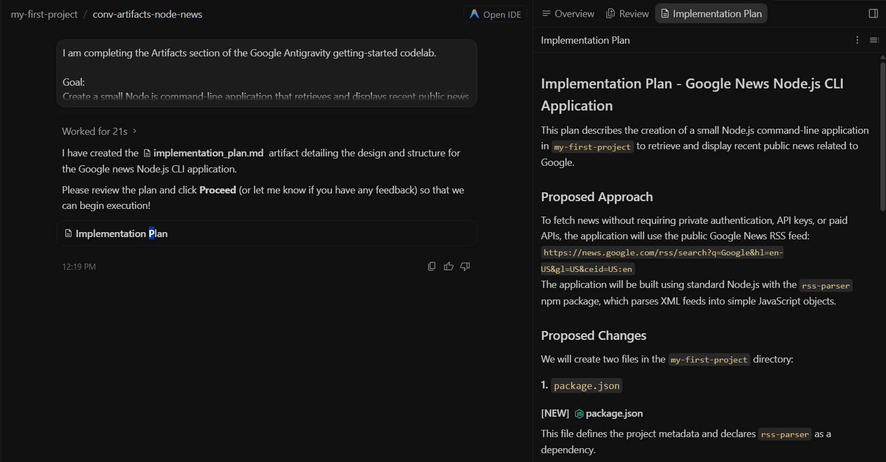
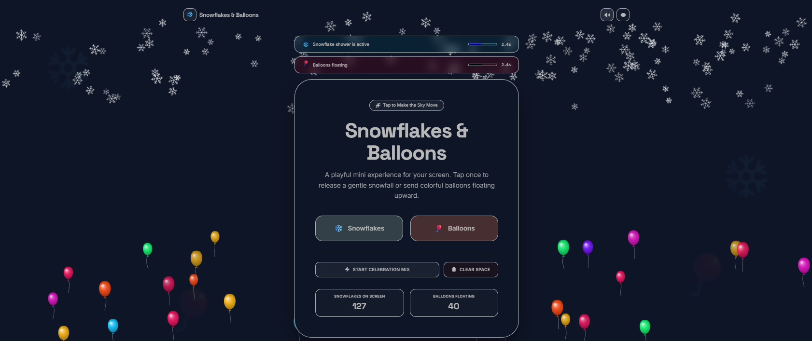

# 🚀 Day 1 — Intro to Agents and Vibe Coding

Day 1 introduced the course direction and turned the ideas into two hands-on builds: one in **Google Antigravity** and one in **Google AI Studio**.

The theme was not “AI writes code, so the developer disappears.” The stronger lesson was that the developer’s job shifts toward better intent, better constraints, better review, and better verification.

---

## 🧭 What Day 1 covered

Day 1 connected three layers:

1. **Conceptual shift** — software development is moving from syntax-first work toward natural-language intent, agent workflows, and verification loops.
2. **Agentic engineering mindset** — useful AI-assisted development needs a harness: tools, sandboxes, orchestration, guardrails, review, and tests.
3. **Hands-on practice** — Antigravity and AI Studio were used to build and refine real artifacts instead of only reading theory.

---

## ✅ Work completed

| Area | Output |
|---|---|
| Livestream and concept notes | Notes on agentic SDLC, context engineering, model + harness, risks, and Day 1 Q&A |
| Antigravity codelab | Google News CLI source project, artifact-review evidence, code-review skill demo |
| AI Studio codelab | Snowflakes & Balloons React/Vite app with refined interaction behavior |
| Deployment | Cloud Run deployment tested, then unpublished to avoid ongoing cost |
| Evidence | Screenshots organized by codelab with descriptions |
| Reflection | Personal learning notes connecting Day 1 to security automation and production thinking |

---

## 🧲 Codelab 1 — Antigravity Getting Started

The Antigravity codelab explored an agentic development environment where the agent can plan, generate artifacts, review changes, and work inside a project structure.

Main artifacts:

- generated `google-news-cli` project
- `index.js` RSS-based Google News search CLI
- `package.json` and `package-lock.json`
- `.agents/skills/code-review/SKILL.md`
- intentionally broken `demo_bad_code.py` used for review testing

📂 [`codelabs/01-antigravity-getting-started/`](./codelabs/01-antigravity-getting-started/)

---

## 🎈 Codelab 2 — AI Studio to Cloud Run

The AI Studio codelab used natural-language instructions to build a small visual app, then refine it into a cleaner browser-only experience.

Main result:

- **Snowflakes & Balloons** app
- React + Vite + TypeScript source
- canvas-based visual effects
- explicit user-triggered animations
- no login, backend, API key, paid service, database, analytics, or private data
- deployment tested through Cloud Run and later unpublished

📂 [`codelabs/02-ai-studio-to-cloud-run/`](./codelabs/02-ai-studio-to-cloud-run/)

---

## 📝 Notes and reflections

- [`notes/day-1-livestream-notes.md`](./notes/day-1-livestream-notes.md)
- [`notes/day-1-whitepaper-notes.md`](./notes/day-1-whitepaper-notes.md)
- [`notes/day-1-key-concepts.md`](./notes/day-1-key-concepts.md)
- [`reflections/day-1-reflection.md`](./reflections/day-1-reflection.md)

---

## 🖼️ Evidence

Screenshots are separated by codelab:

- [`screenshots/codelab-1-antigravity/`](./screenshots/codelab-1-antigravity/)
- [`screenshots/codelab-2-ai-studio-cloud-run/`](./screenshots/codelab-2-ai-studio-cloud-run/)

The screenshots are included to show actual workflow evidence: prompts, generated artifacts, terminal output, settings, app preview, refinement prompts, and final UI state.

---

## 🔐 Security and cleanup notes

- `node_modules/` was excluded from the committed source.
- No real API keys or private `.env` files are included.
- The AI Studio app was intentionally kept browser-only.
- The Cloud Run service was tested and then unpublished to avoid ongoing cost.
- The broken Python file in the Antigravity source folder is a deliberate demo input for the code-review skill, not production code.

---

## 🧠 Main takeaway

Day 1 showed that vibe coding is powerful, but the important engineering work starts after the first generated output. A human still needs to define constraints, review behavior, test edge cases, remove unsafe assumptions, and decide whether the result is maintainable.
