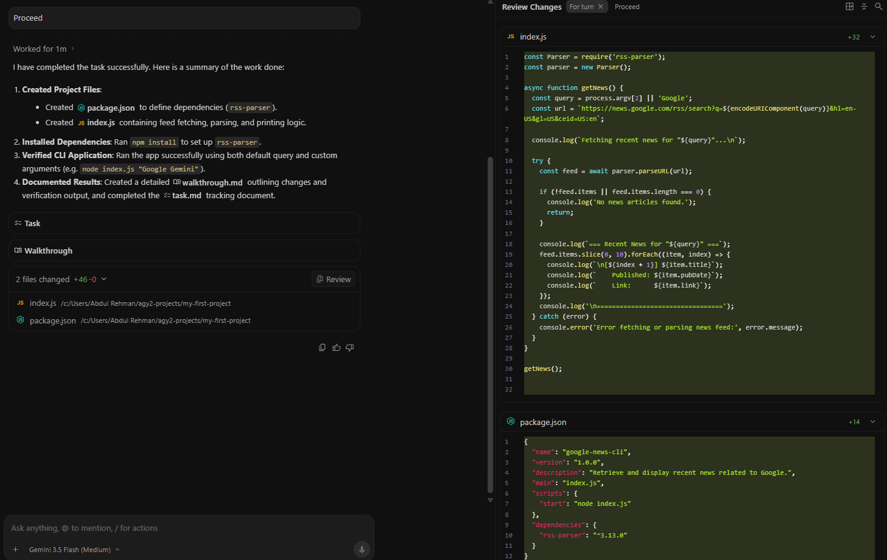
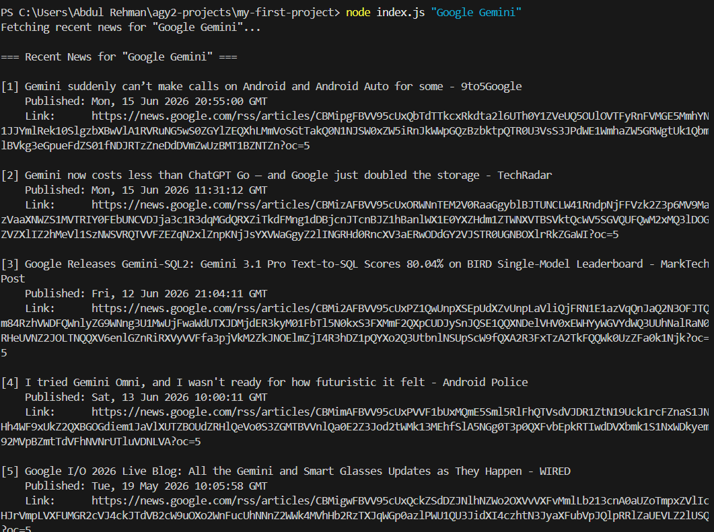

# 🧲 Codelab 1 — Google Antigravity Getting Started

This codelab explored Google Antigravity as an agentic development environment. The goal was to understand how an agent can work inside a project, create artifacts, propose file changes, use settings and permissions, and support code-review style workflows.

---

## 🎯 Purpose

The codelab was not just about generating code. It was about observing the surrounding workflow:

- project/workspace setup,
- agent behavior controls,
- reviewable artifacts,
- browser permissions,
- slash commands,
- MCP server configuration screens,
- scheduled task UI,
- generated source code,
- and reusable agent skills.

That makes it a useful first example of the `model + harness` idea from Day 1.

---

## 🛠️ Tools used

- Google Antigravity
- Antigravity IDE
- Node.js
- `rss-parser`
- Google News RSS endpoint
- `.agents/skills/` project skill structure
- Local terminal for running the generated CLI

---

## 📦 Source included

The actual generated project is stored here:

📂 [`source/google-news-cli/`](./source/google-news-cli/)

Important files:

| File | Purpose |
|---|---|
| [`index.js`](./source/google-news-cli/index.js) | CLI script that fetches recent Google News RSS results for a search query |
| [`package.json`](./source/google-news-cli/package.json) | Node.js project metadata and dependency list |
| [`package-lock.json`](./source/google-news-cli/package-lock.json) | Dependency lockfile for reproducibility |
| [`.agents/skills/code-review/SKILL.md`](./source/google-news-cli/.agents/skills/code-review/SKILL.md) | Custom code-review skill instructions |
| [`demo_bad_code.py`](./source/google-news-cli/demo_bad_code.py) | Intentionally broken demo file used to test code-review feedback |

`node_modules/` was excluded from the repo. It can be recreated with `npm install`.

---

## 🧪 What the generated CLI does

The generated Node.js app accepts a search term and pulls recent results from Google News RSS.

Example usage:

```bash
npm install
npm start
node index.js "Google Gemini"
```

Expected behavior:

- reads the query from the command line,
- defaults to `Google` if no query is provided,
- fetches an RSS feed,
- prints up to 10 recent results,
- displays title, published date, and link.

---

## 🖼️ Evidence highlights

### Implementation planning


The implementation plan shows the agent proposing a structured path before changing files. This is more reviewable than a black-box one-shot response.

### File changes



The review panel shows the key generated files: `index.js` and `package.json`.

### Terminal output



The terminal output confirms the CLI ran with a query and returned structured news results.

### Code-review skill demo


The skill demo shows how a reusable review checklist can be applied to a file with obvious correctness and runtime problems.

---

## 🔍 Workflow observations

Antigravity made several agentic workflow pieces visible:

- the agent can produce a plan before code,
- file changes can be reviewed instead of blindly accepted,
- browser access can be permissioned,
- MCP servers can expand the agent’s tool surface,
- scheduled tasks suggest longer-running automation patterns,
- and skills can store task-specific instructions.

This is a small codelab, but it shows the shape of larger agentic systems.

---

## 🔐 Security and control notes

I treated tool access carefully during this codelab:

- MCP exploration was documented without adding unnecessary external servers.
- Browser permission prompts were treated as approval points.
- The generated project does not contain secrets.
- Dependency folders were not committed.
- The broken Python file is intentionally unsafe as a review target, not an example to run.

---

## 🧠 Reflection

The most useful part was seeing how much of agentic development happens around the code, not only inside the code.

The CLI itself is simple. The important learning was the workflow: plan, review, run, inspect, and preserve evidence. That pattern is what would matter in a real security or automation context.
