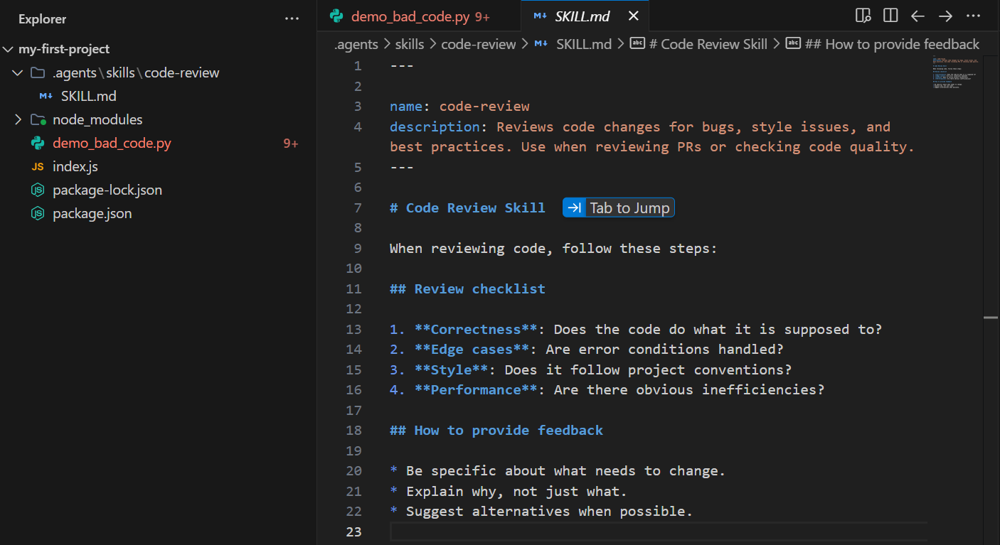
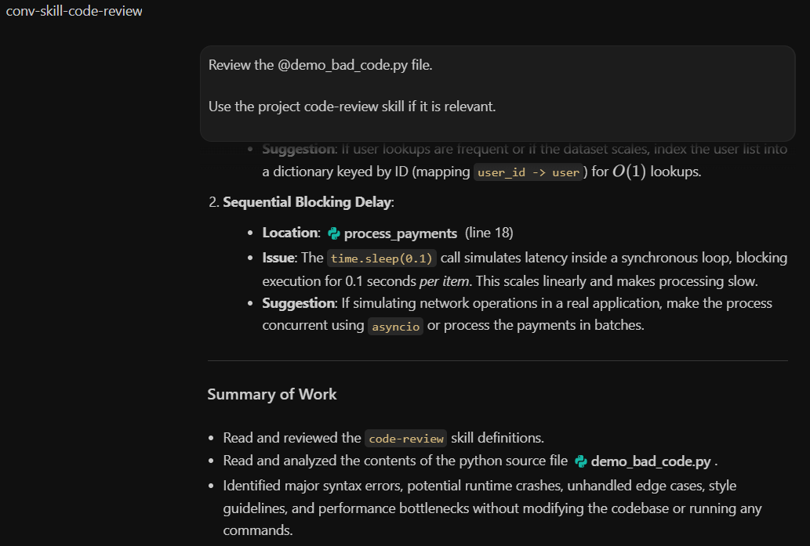

# 🧩 Code Review Skill Demo Notes

This codelab also included a small skill-based review demonstration.

---

## 📁 Skill location

```text
source/google-news-cli/.agents/skills/code-review/SKILL.md
```

The skill defines a reusable review checklist:

- correctness,
- edge cases,
- style,
- performance,
- specific feedback,
- explanation of why changes matter,
- and suggested alternatives.

---

## 🐍 Demo review file

```text
source/google-news-cli/demo_bad_code.py
```

This file is intentionally broken. It should not be treated as production Python.

It contains issues such as:

- broken indentation,
- invalid `if **name** == "**main**"` style syntax,
- unsafe access to `u['name']` when `u` can be `None`,
- artificial delay inside a loop,
- unclear parameter naming,
- and missing input validation.

---

## 🖼️ Evidence





---

## 🧠 Why this matters

This is a small but important example of context engineering.

Instead of repeating a long review prompt every time, the review behavior can live in a project skill. That gives the agent a task-specific checklist only when the task requires it.

For future security automation work, this same idea could become useful for:

- log review checklists,
- alert triage playbooks,
- code security review steps,
- incident report templates,
- or cloud configuration review rules.

The key lesson is that reusable instructions should be treated as part of the engineering system, not as disposable chat text.
