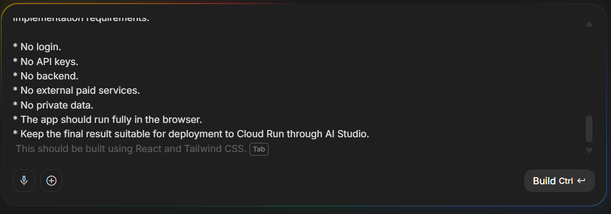
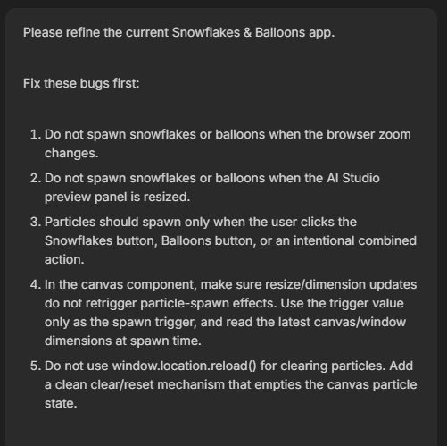
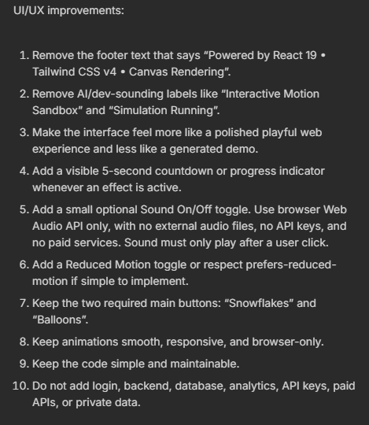

# 🎈 Codelab 2 — AI Studio to Cloud Run

This codelab used Google AI Studio to build a small browser app from natural-language instructions, refine it through follow-up prompts, export the code, and test deployment through Cloud Run.

The result is a playful **Snowflakes & Balloons** app, but the learning goal was serious: practice writing constraints, reviewing generated behavior, validating the output, and cleaning up deployment responsibly.

The app is currently also deployed on Vercel as a public portfolio demo.

🔗 **Live demo:** https://kaggle-ai-agents-vibe-coding-portfo-delta.vercel.app/

> Note: the Vercel link is live at the time of documentation, but it may be removed, paused, redeployed, or replaced later if the hosting setup changes.

---

## 🎯 Purpose

The codelab demonstrated the path from idea to running app:

1. describe the desired app,
2. generate a first version in AI Studio,
3. test the preview,
4. refine bugs and UX problems,
5. export the source code,
6. deploy/test through Cloud Run,
7. clean up/unpublish when the Cloud Run deployment is no longer needed,
8. optionally host the static frontend through a free public platform for portfolio sharing.

---

## 🛠️ Tools used

- Google AI Studio
- React
- Vite
- TypeScript
- Tailwind CSS
- Canvas API
- Web Audio API
- Google Cloud Run for codelab deployment testing
- Vercel for the current public static frontend demo

---

## 📦 Source included

The cleaned app source is stored here:

📂 [`source/snowflakes-and-balloons/`](./source/snowflakes-and-balloons/)

Important files:

| File | Purpose |
|---|---|
| [`src/App.tsx`](./source/snowflakes-and-balloons/src/App.tsx) | Main UI, buttons, countdowns, sound toggle, reduced-motion toggle |
| [`src/components/VisualCanvas.tsx`](./source/snowflakes-and-balloons/src/components/VisualCanvas.tsx) | Canvas animation engine for snowflakes and balloons |
| [`src/index.css`](./source/snowflakes-and-balloons/src/index.css) | Styling and visual polish |
| [`vite.config.ts`](./source/snowflakes-and-balloons/vite.config.ts) | Vite configuration |
| [`package.json`](./source/snowflakes-and-balloons/package.json) | Local run/build scripts and frontend dependencies |

---

## ✅ App behavior

The final app supports:

- `Snowflakes` button,
- `Balloons` button,
- combined celebration action,
- clean reset without page reload,
- active particle counters,
- 5-second progress indicators,
- optional sound toggle using Web Audio,
- reduced-motion toggle,
- responsive canvas rendering,
- user-triggered spawning only.

---

## 🖼️ Evidence highlights

### Browser-only constraints



The initial requirements kept the app intentionally safe and lightweight: no login, no API keys, no server-side API, no paid services, and no private data.

### Behavior refinement



The follow-up prompt fixed a real interaction issue: canvas resize and browser zoom should not trigger particles.

### UX improvement pass



This refinement moved the app away from a generated-looking demo and toward a cleaner user experience.

### Final app state


The final app shows active snowflake/balloon counts, countdown progress, and a polished centered control panel.

---

## ☁️ Deployment status

The app was deployed and tested through Cloud Run during the codelab, then unpublished to avoid ongoing cost.

It is currently available as a Vercel-hosted static frontend demo.

```text
Cloud Run deployment: tested during codelab
Cloud Run live status: unpublished / not currently hosted
Current public demo: Vercel
Vercel URL: https://kaggle-ai-agents-vibe-coding-portfo-delta.vercel.app/
Reason for Vercel hosting: lightweight public portfolio demo
```

Details:

- [`deployment-notes.md`](./deployment-notes.md)

---

## 🚀 Local run

From the app source folder:

```bash
cd source/snowflakes-and-balloons
npm install
npm run dev
```

For a production build:

```bash
npm run build
```

The build output is generated in:

```text
dist/
```

---

## 🔐 Security and privacy notes

This app was intentionally built with low-risk constraints:

- no server-side API requirement,
- no user accounts,
- no database,
- no analytics,
- no external paid API,
- no private user data,
- no required Gemini API key in the cleaned portfolio copy.

The exported AI Studio template contained some generic AI Studio metadata. The portfolio copy keeps the actual frontend app clear and documents that the app itself does not call Gemini or require secrets.

---

## 🧠 Reflection

The first version was visually interesting, but the important work happened in the refinement prompts.

The best lesson from this codelab was that vibe coding becomes much more useful when prompts include engineering constraints: what the app must not do, what services it must not depend on, and what edge cases should be avoided.

The later Vercel deployment added one more practical lesson: once a static app is cleaned and documented properly, it can be shared publicly without keeping the original Cloud Run codelab deployment active.
