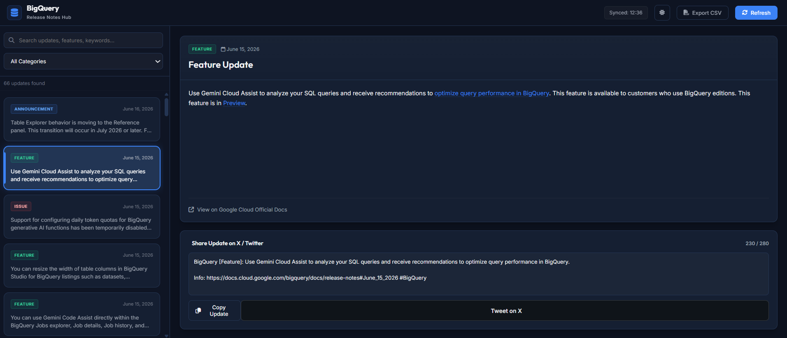
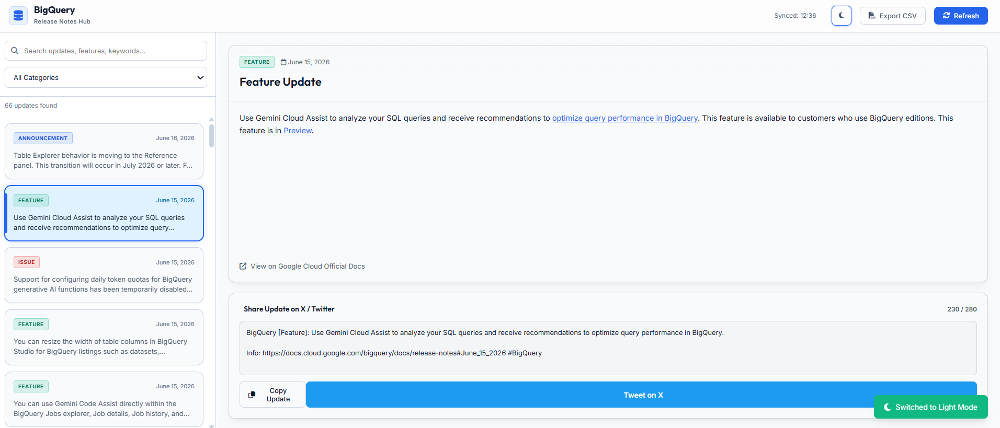
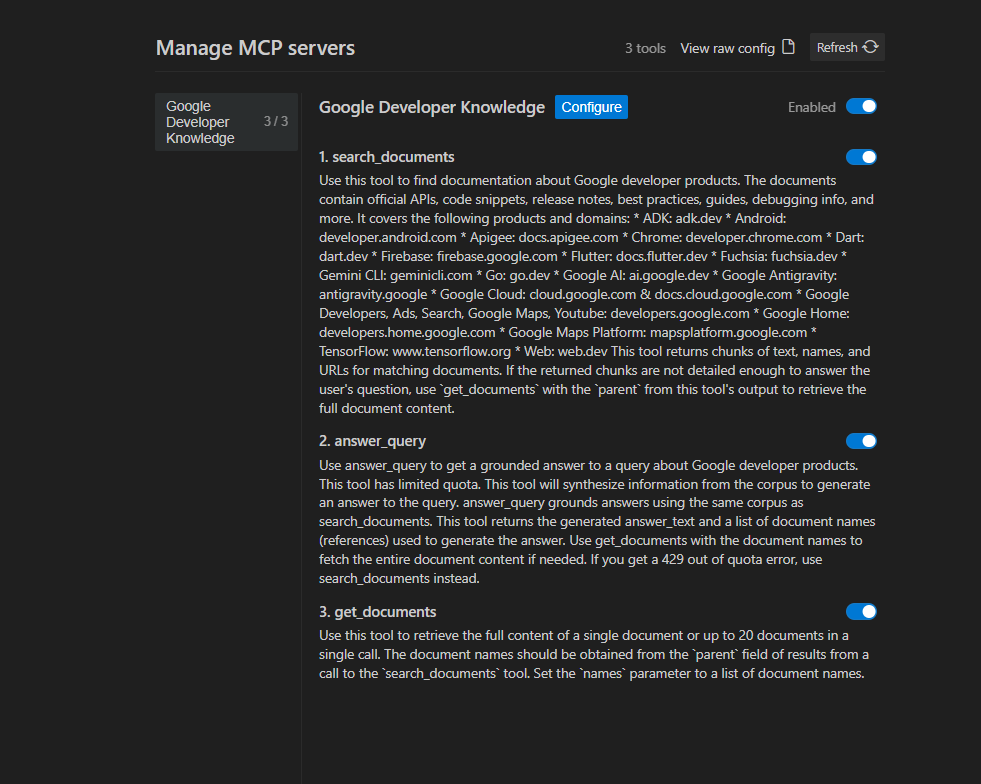
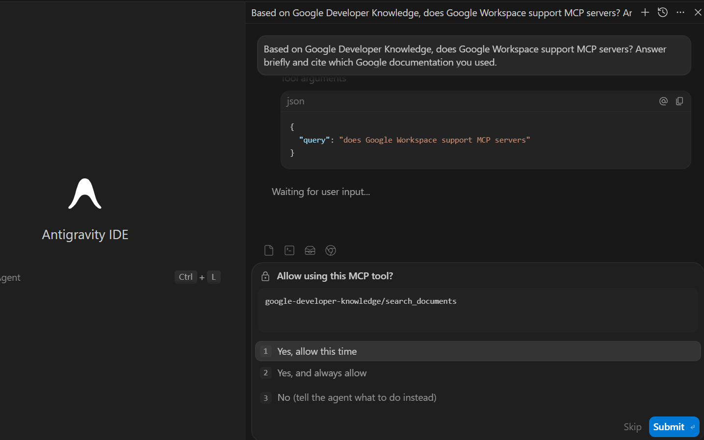

# 🛠️ Day 2 - Agent Tools & Interoperability

This folder documents my work for **Unit 2: Agent Tools & Interoperability** from the Google/Kaggle 5-Day AI Agents Intensive Vibe Coding Course.

Day 1 helped me understand how agents can assist with building and refining software. Day 2 shifts the focus to a bigger engineering question:

> How do agents connect safely and reliably to tools, data sources, user interfaces, other agents, and real-world transaction systems?

The answer from this unit is not "make one giant agent smarter." The answer is **standardized interoperability**. Instead of every model, tool, API, and specialist agent needing custom glue code, protocols such as **MCP, A2A, A2UI, UCP, and AP2** create shared connection layers.

This folder now includes the Day 2 theory work and both completed Day 2 hands-on codelabs.

---

## 📌 Current status

| Area | Status | Notes |
|---|---|---|
| Unit podcast | ✅ Completed | Watched and summarized with timestamped notes. |
| Whitepaper | ✅ Completed | Read through the full paper and converted the main ideas into study notes. |
| NotebookLM study work | ✅ Completed | Generated study guide, Q&A, quiz review, and visual summaries. |
| Infographics | ✅ Completed | Added two visual summaries for quick revision. |
| Antigravity CLI codelab | ✅ Completed | Built, refined, tested, deployed on Render, and documented the BigQuery Release Notes Hub app. |
| Google Developer Knowledge MCP codelab | ✅ Completed | Configured and validated the Google Developer Knowledge MCP server in Antigravity using documentation-backed prompts and screenshot evidence. |

Both Day 2 hands-on codelabs are now documented. Codelab 1 focused on agent-assisted local app development, while Codelab 2 focused on MCP server configuration, permission review, and documentation retrieval through Antigravity.

---

## 🧪 Hands-on Codelab 1 update

The first Day 2 hands-on codelab used **Antigravity CLI** to build a local Flask web app from natural-language instructions.

The final app is called **BigQuery Release Notes Hub**.

It fetches the BigQuery release notes XML feed, parses release-note entries into individual updates, displays them in a searchable dashboard, and includes practical sharing/export features.

📂 Codelab folder: [`codelabs/01-antigravity-cli/`](./codelabs/01-antigravity-cli/)

🔗 Live demo: https://kaggle-day2-bigquery-release-notes.onrender.com/

> Note: the live app is hosted on a free Render instance, so the first load after inactivity may be delayed while the service wakes up.

### Final app highlights

- Flask backend for feed fetching and parsing.
- Vanilla HTML/CSS/JavaScript frontend.
- Search and category filtering.
- Manual refresh flow.
- X/Twitter-ready release-note composer.
- Copy Update button.
- Export CSV button.
- Light/dark theme toggle.
- Clean tweet text under the 280-character limit.
- Local Git checkpoints for generated app, UI polish, and final extensions.
- Public Render deployment using `gunicorn app:app`.

### Evidence snapshot





This codelab made the Day 2 theory feel practical: the agent was not only producing text, it was using tools, writing files, running commands, generating artifacts, and then improving the app through review and testing. After local validation, I deployed the Flask app publicly on Render and documented the deployment fix in the codelab folder.

---

## 🔌 Hands-on Codelab 2 update

The second Day 2 hands-on codelab used **Google Developer Knowledge MCP** inside **Google Antigravity**.

This codelab was not an app-building exercise. Its purpose was to configure and validate an MCP connection so Antigravity could use an official documentation-search tool during a development conversation.

📂 Codelab folder: [`codelabs/02-google-developer-knowledge-mcp/`](./codelabs/02-google-developer-knowledge-mcp/)

### Final validation highlights

- Developer Knowledge API and API-key setup completed.
- Google Developer Knowledge MCP server enabled in Antigravity.
- MCP tools visible: `search_documents`, `answer_query`, and `get_documents`.
- Tool-use permission prompt captured before documentation search.
- Successful MCP-backed answers captured for Google Workspace, Cloud Run, Cloud Functions, and Flask deployment questions.
- Sanitized config template included without committing real credentials.
- Screenshot evidence organized in [`screenshots/codelab-2-developer-knowledge-mcp/`](./screenshots/codelab-2-developer-knowledge-mcp/).

### Evidence snapshot





This codelab made the MCP theory concrete. The agent could move beyond general model memory, ask permission to call a documentation tool, retrieve Google developer documentation, and return a grounded answer inside the Antigravity workflow.

---

## 🖼️ Visual summary

The first visual helped me understand the unit as a virtual factory: MCP connects tools, A2A connects agents, A2UI connects agents to human-facing interfaces, and AP2/UCP connect agents to commerce and payments.


The second visual helped me see the architecture shift more clearly: from a fragile monolithic agent to a modular agent ecosystem with standardized connection layers.


---

## 🧠 Main learning summary

The main idea I took from Day 2 is that agent systems are becoming less like isolated chatbots and more like **distributed software systems**. Once an agent starts using tools, calling APIs, collaborating with other agents, creating UI, or handling payments, the problem is no longer only prompt quality. The problem becomes architecture, permissions, protocols, debugging, and trust.

A few concepts stood out strongly:

| Concept | My working understanding |
|---|---|
| MCP | The standard connection layer between models and tools/data sources. It reduces custom integration work. |
| A2A | A communication layer for agents that need to collaborate, delegate, pause, resume, and negotiate. |
| Agent Card | A machine-readable profile that tells other systems what an agent can do and how to interact with it. |
| A2UI | A safe way for agents to describe interfaces without generating arbitrary executable frontend code. |
| UCP | A commerce interaction protocol for browsing catalogs, building carts, and communicating with providers. |
| AP2 | A payment protocol designed to keep agentic payments authorized, auditable, and rule-bound. |

The clearest mental model for me is this:

```text
MCP  -> agent to tools
A2A  -> agent to agent
A2UI -> agent to user interface
UCP  -> agent to commerce/catalog/order systems
AP2  -> agent to authorized payment execution
```

---

## 📁 Folder contents

| File / Folder | Purpose |
|---|---|
| [`notes/day-2-podcast-notes.md`](./notes/day-2-podcast-notes.md) | Human-readable notes from the Unit 2 podcast/video summary. |
| [`notes/day-2-whitepaper-notes.md`](./notes/day-2-whitepaper-notes.md) | Deeper technical notes from the whitepaper. |
| [`notes/day-2-key-concepts.md`](./notes/day-2-key-concepts.md) | Compact glossary of the main protocols and architecture terms. |
| [`notes/day-2-study-guide-summary.md`](./notes/day-2-study-guide-summary.md) | Summary of the NotebookLM/NoteGPT study process and quiz review. |
| [`codelabs/01-antigravity-cli/`](./codelabs/01-antigravity-cli/) | Completed Antigravity CLI hands-on codelab with source, artifacts, prompts, commands, validation notes, and Render deployment notes. |
| [`codelabs/02-google-developer-knowledge-mcp/`](./codelabs/02-google-developer-knowledge-mcp/) | Completed Google Developer Knowledge MCP codelab with setup notes, prompt-result validation, sanitized config template, and screenshot evidence. |
| [`reflections/day-2-reflection.md`](./reflections/day-2-reflection.md) | Personal reflection on theory plus hands-on learning. |
| [`resources/day-2-links.md`](./resources/day-2-links.md) | Official links and reference links used for this unit. |
| [`resources/source-material-note.md`](./resources/source-material-note.md) | Notes on what source materials were used and what was intentionally not committed. |
| [`screenshots/`](./screenshots/) | Screenshot evidence from both Day 2 hands-on codelabs. |
| [`assets/infographics/`](./assets/infographics/) | Visual study assets generated during the Day 2 learning process. |

---

## 🔌 Why MCP clicked for me

Before this unit, it was easy to think of tools as a simple add-on: give the agent an API and let it call it. The whitepaper made the scaling problem clearer.

If every model needs a custom connection to every tool, integration complexity grows quickly:

```text
Traditional integration: O(N x M)
Protocol-based integration: O(N + M)
```

That is the practical reason MCP matters. It is not just a buzzword. It is an attempt to prevent every team from writing and maintaining fragile wrappers for every model-tool pair.

For a learner, the important lesson is simple: **consume standard MCP servers where possible, configure them carefully, and avoid inventing custom wrappers too early.**

---

## 📻 Why A2A is different from tool calling

This was one of the biggest conceptual differences in Day 2.

A tool is usually bounded. It receives a request and returns a result. A specialist agent is different. It may need clarification, negotiation, back-and-forth decisions, or stateful collaboration.

That means a specialist agent should not always be squeezed into the shape of a simple tool. A2A exists because agent collaboration is closer to working with a remote teammate than calling a calculator function.

---

## 🛡️ Security notes I want to remember

This unit also made the security side more visible. Agent interoperability is powerful, but every connection is also a possible risk boundary.

Important guardrails:

- Do not hardcode API keys or tokens inside prompts, scripts, or committed config files.
- Prefer official or vetted MCP servers when possible.
- Avoid connecting unverified MCP servers to sensitive local files or production data.
- Scope tool permissions narrowly.
- Use read-only access when write access is not required.
- Debug transport/tool schema issues directly instead of only changing the prompt.
- Keep humans in the loop for sensitive actions, especially data movement and payments.
- Keep generated local folders such as `.venv/`, `.gemini/`, and `__pycache__/` out of the public repo.

This connects directly to my cybersecurity interest because agentic systems will need the same discipline as any other automation system: least privilege, logging, isolation, review, and safe failure behavior.

---

## 🧪 Hands-on work completed

The Day 2 practical work now has two different kinds of evidence:

1. **Antigravity CLI app build** — an agent used local development tools to create, test, refine, and deploy a Flask app.
2. **Developer Knowledge MCP validation** — Antigravity used an MCP server to search Google developer documentation after a visible permission prompt.

Together, these codelabs show the two sides of Day 2 clearly:

```text
local tool-using agent workflow + remote documentation-search MCP workflow
```

The next course work can now move into Day 3 while keeping Day 2 as the reference point for agent tooling, permission boundaries, and interoperability.

---

## ✅ Current takeaway

Day 2 made me realize that useful agents are not only about model intelligence. They also depend on the system around the model: tool access, protocol boundaries, security policies, UI rendering, commerce rules, and collaboration patterns.

The Antigravity CLI codelab reinforced that lesson through local app development. A tool-using agent can build useful software quickly, but the work only becomes reliable when the human reviews permissions, tests the output, catches edge cases, and documents what actually happened.

The Developer Knowledge MCP codelab added the second half of the lesson. A connected agent can retrieve official documentation when it needs it, but the human still needs to check the tool call, understand what data source is being used, and keep credentials out of the public repo.
