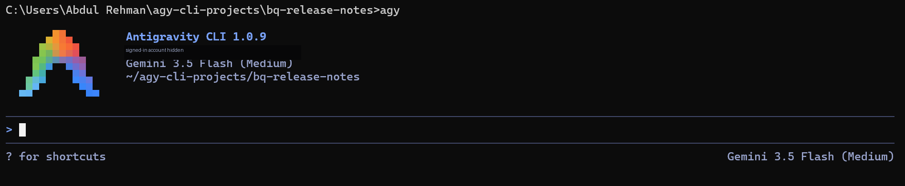
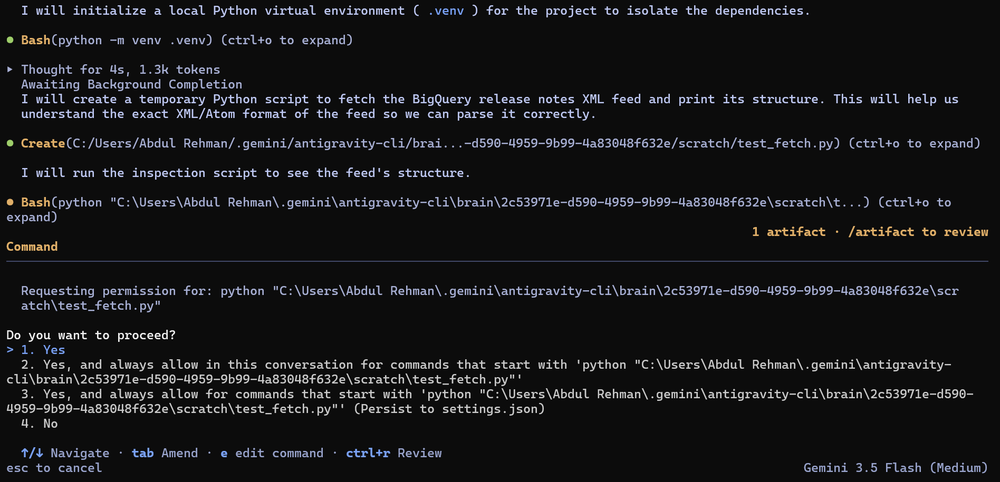
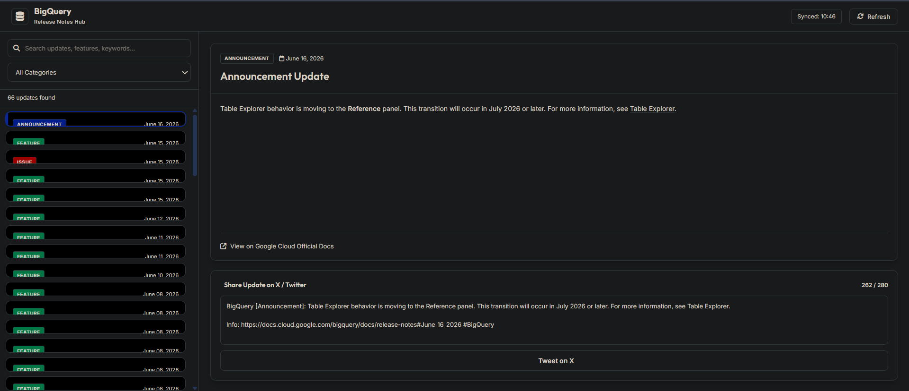
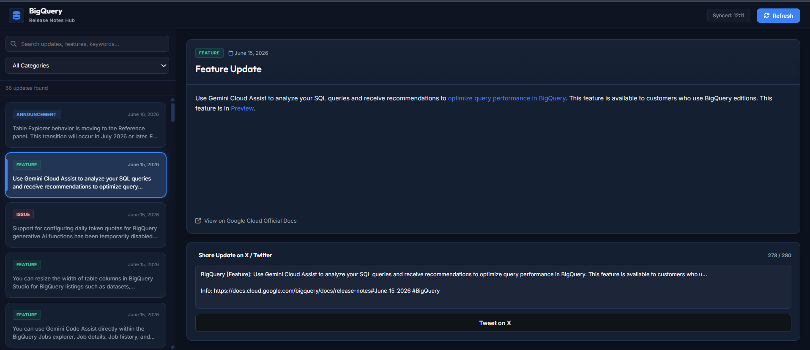
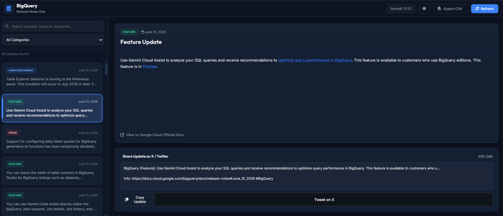

# 🧪 Codelab 1 — Antigravity CLI BigQuery Release Notes App

This folder documents my Day 2 hands-on work for the official **Antigravity CLI** codelab.

The goal was not only to run a command-line AI tool. The real learning goal was to experience how an agentic development assistant can inspect a project folder, use tools, create code, run local commands, generate artifacts, improve the result through human review, and then move the finished app into a public deployment workflow.

The final output is a Flask web app called **BigQuery Release Notes Hub**.

It fetches the Google Cloud BigQuery release notes XML feed, parses individual updates, displays them in a searchable dashboard, adds practical sharing/export features, and is now publicly deployed on Render for portfolio/demo access.

🔗 **Live demo:** https://kaggle-day2-bigquery-release-notes.onrender.com/

> Note: the Render deployment is currently live for portfolio/demo purposes. Because it uses a free Render instance, the first request after inactivity can be delayed while the service wakes up.

---

## 🎯 What I built

I built a web app that turns the BigQuery release notes feed into a small interactive dashboard.

Final app capabilities:

- live BigQuery release notes feed parsing,
- searchable and filterable update cards,
- master-detail release-note viewer,
- manual refresh with feed cache behavior,
- X/Twitter-ready update composer,
- Copy Update button,
- Export CSV for currently visible updates,
- light/dark theme toggle,
- cleaned tweet formatting under 280 characters,
- UI polish for Windows browser contrast issues,
- and public Flask deployment on Render.

The app is intentionally simple in architecture: Python Flask on the backend, vanilla HTML/CSS/JavaScript on the frontend, and Gunicorn as the production server process on Render.

---

## 🧭 Why this belongs in Day 2

Day 2 is about **Agent Tools & Interoperability**.

This codelab made that theme practical. Antigravity CLI was not just answering questions. It used tools around the model:

- terminal commands,
- local file creation,
- temporary inspection scripts,
- dependency installation,
- local server execution,
- browser-visible output,
- artifacts,
- iterative code modification,
- Git checkpoints,
- and deployment configuration.

That changed the work from a chat response into an agentic development workflow. The agent could act inside a real workspace, but the important part was still human review: checking permissions, testing the app, noticing UI problems, asking for focused fixes, and validating the public deployment.

---

## 🛠️ Tools and environment

| Area | Details |
|---|---|
| OS | Windows |
| Terminal | Command Prompt |
| Agent tool | Antigravity CLI |
| Language/runtime | Python 3 |
| Web framework | Flask |
| Production server | Gunicorn |
| Frontend | Vanilla HTML, CSS, JavaScript |
| Version control | Git |
| Deployment platform | Render Web Service |
| Live URL | https://kaggle-day2-bigquery-release-notes.onrender.com/ |

I used a dedicated workspace folder instead of running the agent directly from the home directory:

```text
%USERPROFILE%\agy-cli-projects\bq-release-notes
```

For the portfolio copy, local-only folders such as `.venv/`, `__pycache__/`, `.git/`, and `.gemini/` are excluded.

---

## 📦 Folder contents

| Path | Purpose |
|---|---|
| [`source/bq-release-notes/`](./source/bq-release-notes/) | Final Flask app source code. |
| [`deployment-notes.md`](./deployment-notes.md) | Notes about the Render deployment, first failed start command, final configuration, and hosting limitations. |
| [`commands-used.md`](./commands-used.md) | Exact commands used during setup, verification, Git checkpoints, testing, and deployment preparation. |
| [`prompts-used.md`](./prompts-used.md) | The Antigravity prompts used to build, polish, extend, and QA the app. |
| [`observations.md`](./observations.md) | Practical notes about what happened, what differed from expectation, and what I learned. |
| [`testing-and-validation.md`](./testing-and-validation.md) | Manual QA checklist and final validation results. |
| [`artifacts/release-notes-app-summary.md`](./artifacts/release-notes-app-summary.md) | Cleaned Antigravity-generated project summary artifact. |
| [`artifacts/inspection-scripts/`](./artifacts/inspection-scripts/) | Sanitized scratch scripts generated during feed and parser inspection. |
| [`exports/bigquery-release-notes.csv`](./exports/bigquery-release-notes.csv) | Sample CSV export produced by the final app. |

---

## 🧱 App architecture

```text
Google Cloud BigQuery XML feed
        ↓
Flask backend in app.py
        ↓
/api/release-notes JSON endpoint
        ↓
Browser UI in templates/index.html
        ↓
static/js/main.js + static/css/style.css
        ↓
Search, filter, copy, export, theme toggle, and X/Twitter share
        ↓
Render Web Service running gunicorn app:app
```

The backend does the feed fetching and parsing. The frontend handles interaction, filtering, copy/export behavior, theme state, and tweet drafting. Render hosts the Flask app as a public web service.

---

## 🖼️ Evidence highlights

### Workspace-scoped CLI launch



I launched Antigravity CLI from the dedicated `bq-release-notes` folder. This kept the workspace scoped to the app instead of giving the agent a broad home-directory context.

### Human-in-the-loop permission review



Antigravity asked before running the temporary feed-inspection script. I used one-time approvals rather than broad always-allow permissions.

### First working app



The first generated app worked, but it still needed human QA. Some UI details were clipped or low-contrast on Windows.

### UI polish after review



After testing the first version, I asked Antigravity for a targeted UI polish pass. This fixed sidebar spacing, selected-card readability, dropdown contrast, and button behavior.

### Extended codelab features



The final app includes the additional codelab-style improvements: Copy Update, Export CSV, and theme toggle.

### Final QA pass


The last QA pass fixed two realistic issues: generated tweet text should not end with broken ellipses, and light mode needed better selected-card contrast.

### Public Render deployment


After the local app was stable, I deployed the Flask version on Render as a public Web Service. The app is available at:

```text
https://kaggle-day2-bigquery-release-notes.onrender.com/
```

---

## 🧪 Final validation summary

The final app was manually tested for:

- local app startup,
- release-note loading,
- search,
- category filtering,
- refresh,
- Copy Update,
- Export CSV,
- light/dark theme persistence,
- clean tweet text under 280 characters,
- X/Twitter intent popup,
- readability in both dark and light themes,
- Render deployment startup,
- and live public access.

Detailed validation notes are in [`testing-and-validation.md`](./testing-and-validation.md). Deployment-specific notes are in [`deployment-notes.md`](./deployment-notes.md).

---

## 🧠 What made this codelab useful

The most useful part was not that Antigravity generated code quickly.

The useful part was the loop:

```text
prompt → tool action → permission review → artifact/code output → manual test → focused fix → Git checkpoint → deployment check
```

That loop is much closer to real development than a one-shot generated answer.

The app became better because I tested it, noticed problems, asked for targeted changes, and debugged the deployment configuration. That is the main Day 2 lesson for me: tool-using agents are powerful, but they still need scoped permissions, review checkpoints, hands-on verification, and deployment discipline.

---

## 🚀 Public deployment note

This version is a Flask app and is now publicly deployed on Render:

```text
https://kaggle-day2-bigquery-release-notes.onrender.com/
```

Render deployment configuration:

```text
Service type: Web Service
Runtime: Python
Root directory: 02-day-2-agent-tools-and-interoperability/codelabs/01-antigravity-cli/source/bq-release-notes
Build command: pip install -r requirements.txt
Start command: gunicorn app:app
```

The first deployment attempt built successfully but failed during startup because the service was still trying to run a placeholder start command:

```text
gunicorn your_application.wsgi
```

The fix was to use the actual Flask module and app variable:

```text
gunicorn app:app
```

The deployment is intended as a public portfolio/demo link. Because it runs on a free Render instance, the service may spin down after inactivity and take extra time to wake up on the next request.

I am keeping the source code, CSV export sample, cleaned artifact summary, and sanitized inspection scripts in this folder because they may be useful later if I convert the dashboard to Streamlit, redeploy it elsewhere, or reuse the parser as a backend module.

---

## ✅ Status

```text
Antigravity CLI codelab: completed
Generated app: completed
UI polish: completed
Extension features: completed
Manual QA: completed
Local Git checkpoints: completed
Public deployment: completed on Render
Google Developer Knowledge MCP codelab: pending
```
