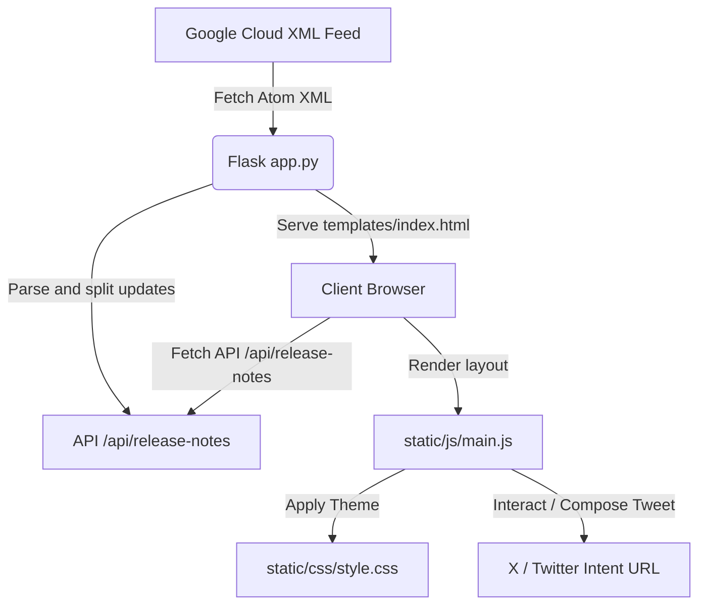

# BigQuery Release Notes Hub - Project Summary

We have built a modern, responsive Web Application that retrieves Google Cloud BigQuery Release Notes from the official feed and presents them in an interactive layout. 

---

## 🏗️ Architecture



### Key Modules and Code Links
- **Backend Entry & Parser:** [app.py](../source/bq-release-notes/app.py)
  - Fetches the XML from the Google Cloud feeds.
  - Collapses whitespace and parses entry fields using `xml.etree.ElementTree`.
  - Splits compound HTML updates by parsing `<h3>` headings using `BeautifulSoup`.
  - Implements a 5-minute memory-caching decorator (`fetch_feed`).
- **User Interface (HTML):** [templates/index.html](../source/bq-release-notes/templates/index.html)
  - Responsive Master-Detail layout.
  - Search bar, type selectors, item count stats.
  - Detail view container with document links and the Tweet Composer.
- **Styles (CSS):** [static/css/style.css](../source/bq-release-notes/static/css/style.css)
  - Sleek modern dark mode using HSL/Hex variables.
  - Responsive media queries that implement mobile drawer animations (using translations).
  - Custom category-based color badges.
  - Keyframe animations for load spinners and card hovering.
- **Frontend Logic (JS):** [static/js/main.js](../source/bq-release-notes/static/js/main.js)
  - Real-time search/filtering.
  - Inter-dependent master-detail state mapping.
  - Pre-composed tweet text based on character limits (280 max).
  - Force refresh bindings.

---

## 📋 Features & Interactive Walkthrough

### 1. XML Splitting
The Google Cloud feed packages all updates for a single day into one XML entry. Our backend parses this content and extracts each heading (`<h3>Feature</h3>`, `<h3>Issue</h3>`, etc.) as a separate, selectable record. This results in **66 distinct updates** (at current state) instead of just 30 raw dates, giving you discrete granularity.

### 2. X / Twitter Intent Integration
When you select an update card:
- The app generates a customized prefilled tweet inside the editor.
- For example:
  ```text
  BigQuery [Feature]: Use Gemini Cloud Assist to analyze your SQL queries and receive recommendations to optimize query performance in BigQuery (Preview).

  Info: https://docs.cloud.google.com/bigquery/docs/release-notes#June_15_2026 #BigQuery
  ```
- It counts the character length dynamically. If it exceeds **280**, it shows a warning and disables the action.
- Clicking **Tweet on X** opens a secure pop-up composing window targeting Twitter's Web Intent directly.

### 3. Quick Caching & Force Refresh
- To keep operations fast and avoid rate-limiting from Google's XML feed, the application caches data in memory for **5 minutes**.
- You can bypass the cache at any time using the **Refresh** button in the header. The spinner will animate, fetch live feed details, update the cache, and show a visual Toast notification upon completion.

### 4. 🎨 Recent UI/UX Refinements (Windows & Portfolio Polish)
- **Zero-Clipping Sidebar Layout:** Expanded list padding, card spacing, and added `scrollbar-gutter: stable` to ensure sidebar note cards are never cropped by browser scrollbars.
- **Header Glassmorphism:** Implemented a modern translucent header styling (`backdrop-filter: blur(12px)`) for a premium portfolio appearance.
- **Windows Contrast Correction:** Explicitly styled target `<option>` tags inside select dropdowns with a solid background `#0f1524` and white text, solving default Windows browser low-contrast rendering bugs.
- **Interactive Tweet Sharing Widget:** Added transition transforms to the "Tweet on X" button so it lifts up (`translateY(-2px)`) on hover, smoothly inverts colors, and has visual feedback when clicked (active state) or disabled.
- **Selected-Card Readability:** Raised text contrast of the selected card snippet and added a glowing outer-shadow border to make the currently active note pop out clearly.
- **Typographical Polish:** Enhanced line heights, list padding indentations, and styled code elements inside detail content block views.

### 5. 🛠️ Extended Features (Codelab Improvements)
- **Copy to Clipboard:** Added a "Copy Update" secondary button inside the Tweet composer footer. It copies the precomposed character-counted tweet (complete with links and hashtags) using the `navigator.clipboard` API with an asynchronous `execCommand` fallback for maximum browser compatibility (e.g. non-HTTPS environments). Displays a green clipboard toast alert.
- **Export to CSV:** Added an "Export CSV" icon button in the header actions. It loops through the *currently visible/filtered* notes (matching your search terms and category flags) and serializes them under standard RFC 4180 rules (doubling internal quotes and wrapping values in double-quotes). Automatically triggers a browser download for `bigquery-release-notes.csv`.
- **Light/Dark Theme Toggle:** Added a theme switch button in the header actions (using font-awesome sun/moon icons). The system loads the user's preferred theme from `localStorage` on load, swaps body styles via class hooks, and transitions colors smoothly using native CSS variables. All badge contrasts are dynamically elevated in Light Mode.
- **Visual QA Pass Refinements:**
  - *Clean Sentence Tweet Formatting:* Upgraded the tweetcomposer text generator to parse input text into full sentences using ES6 lookbehind splits. It matches as many complete sentences as possible under the character limit, and falls back to clean word-boundary truncation ending with `. Read more in the docs.` rather than clipped ellipsis.
  - *Light Mode Tweet Button:* The "Tweet on X" button transitions from solid X black in dark mode to X's signature brand blue (`#1d9bf0`) with white text in light mode, maintaining high-contrast primary action indicators.
  - *Light Mode Card Spacing Contrast:* Overrode the active card class to show a premium sky blue tint (`#e0f2fe`) in light mode, with contrast overrides for the date (`#0369a1`) and snippet (`#0f172a`), matching the dark mode selection glows perfectly.

---

## 🚀 How to Run the Server

The Flask application was run locally during the codelab.

To verify or restart the server manually:
1. Open PowerShell or Command Prompt.
2. Run:
   ```bash
   cd "%USERPROFILE%\agy-cli-projects\bq-release-notes"
   .venv\Scripts\python.exe app.py
   ```
3. Open your browser and go to: **[http://127.0.0.1:5000](http://127.0.0.1:5000)**
