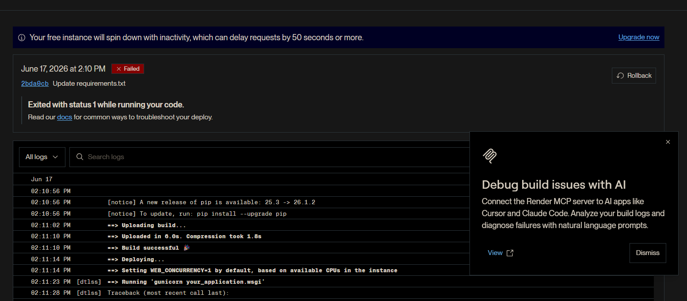
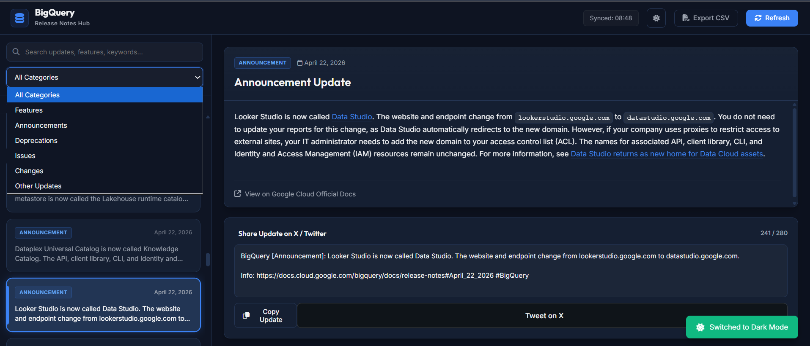

# 🚀 Deployment Notes — BigQuery Release Notes Hub

This file records the public deployment step for the Day 2 Codelab 1 Flask app.

The app was originally built and tested locally during the Antigravity CLI codelab. After the local build, UI polish, extension features, and QA refinements were completed, I deployed the Flask app publicly on Render.

---

## 🔗 Live app

Live demo:

```text
https://kaggle-day2-bigquery-release-notes.onrender.com/
```

Hosting platform:

```text
Render Web Service
```

Current purpose:

```text
Portfolio/demo deployment for the Day 2 Antigravity CLI codelab.
```

---

## 📦 What was deployed

The deployed app source lives in this repo folder:

```text
02-day-2-agent-tools-and-interoperability/
└── codelabs/
    └── 01-antigravity-cli/
        └── source/
            └── bq-release-notes/
```

The deployed Flask app includes:

- `app.py` for the backend feed fetching and parsing,
- `templates/index.html` for the dashboard layout,
- `static/css/style.css` for dark/light theme styling,
- `static/js/main.js` for search, filter, copy, export, theme, and tweet composer behavior,
- `requirements.txt` for Python dependencies,
- and `gunicorn` as the production server dependency.

Generated local folders such as `.venv/`, `__pycache__/`, `.git/`, and `.gemini/` are not part of the deployment source.

---

## ⚙️ Render configuration

The app was deployed as a **Web Service**, not a Static Site.

A static site would not work for this version because the app depends on a running Flask backend to fetch and parse the BigQuery XML feed.

Final Render settings:

```text
Service type: Web Service
Repository: Kaggle-AI-Agents-Vibe-Coding-Portfolio
Branch: main
Runtime: Python
Root directory: 02-day-2-agent-tools-and-interoperability/codelabs/01-antigravity-cli/source/bq-release-notes
Build command: pip install -r requirements.txt
Start command: gunicorn app:app
Instance type: Free
Auto deploy: On Commit
```

No environment variables or secret files were required.

---

## 🧩 Required dependency update

For local development, the Flask app can run with:

```cmd
python app.py
```

For Render deployment, the app needs a production WSGI server. I added `gunicorn` to `requirements.txt`:

```text
gunicorn
```

The final start command uses the Flask app object inside `app.py`:

```text
gunicorn app:app
```

This means:

```text
app      -> the Python file app.py
app      -> the Flask object named app inside that file
```

---

## 🛠️ Deployment issue and fix

The first Render build succeeded, but the deploy step failed because Render was still using a placeholder start command:

```text
gunicorn your_application.wsgi
```

That module does not exist in this project, so the service crashed with:

```text
ModuleNotFoundError: No module named 'your_application'
```

Evidence:



The fix was to change the Render start command to:

```text
gunicorn app:app
```

After that change, the Flask app deployed successfully and became publicly accessible.

Evidence:



---

## ✅ Post-deployment validation

After the deployment succeeded, I verified the live app in the browser.

Checked on the public Render URL:

- app loads successfully,
- BigQuery release notes are fetched and displayed,
- search works,
- category filter works,
- refresh works,
- Copy Update button is visible,
- Export CSV button is visible,
- light/dark theme toggle works,
- tweet composer stays under the character limit,
- and the final UI polish is visible in the deployed version.

---

## ⚠️ Free-tier note

This app is hosted on a free Render instance.

That means:

- the service may spin down after inactivity,
- the first request after inactivity can be delayed,
- the public URL may feel slow when waking up,
- and the deployment may be paused, removed, or migrated later.

This is expected behavior for the hosting tier and not a problem with the app source.

---

## 🔐 Security and privacy notes

No API keys, OAuth tokens, private credentials, or environment variables are required for this app.

The app reads a public Google Cloud BigQuery release notes XML feed. It does not store user data and does not require authentication.

Before documenting the deployment, I avoided including private backend conversation details. The repo only records the engineering workflow, the deployment configuration, the startup error, and the final fix.

---

## 🧠 What this deployment taught me

The local app build was only one part of the workflow.

Deployment added another practical lesson: generated apps still need production configuration.

The main issue was not Python code. The build passed. The failure came from the wrong server start command. Fixing it required understanding how Flask, Gunicorn, and Render connect:

```text
Flask app source → Gunicorn start command → Render Web Service runtime
```

That made the codelab more complete because it moved the project from local agent-generated code to a public working web app.
