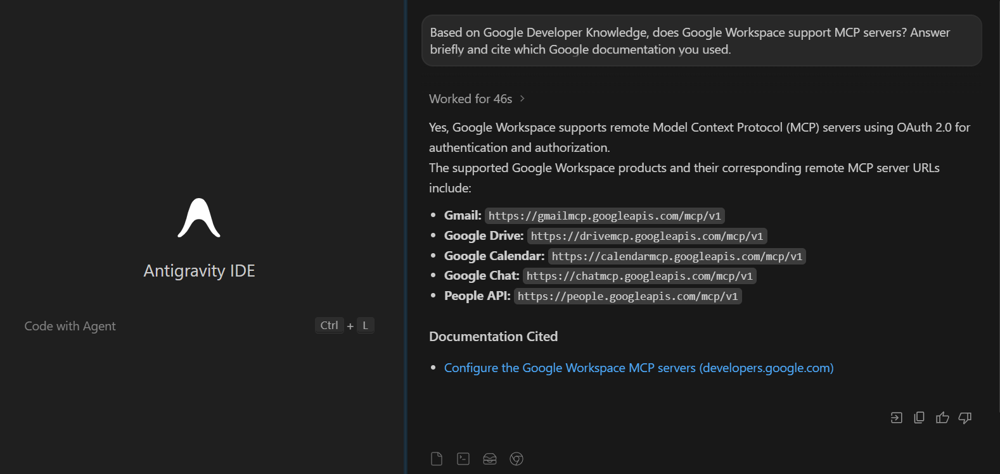
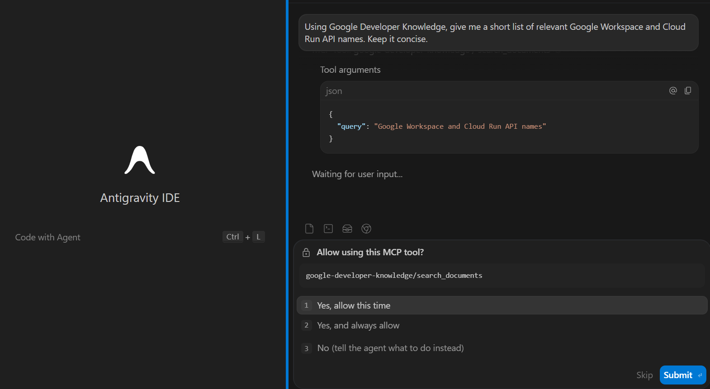
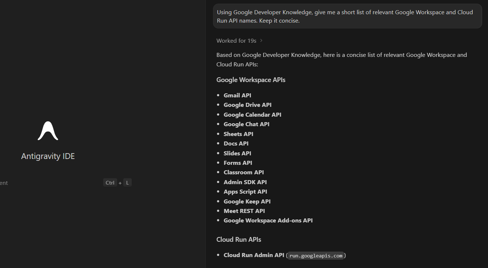
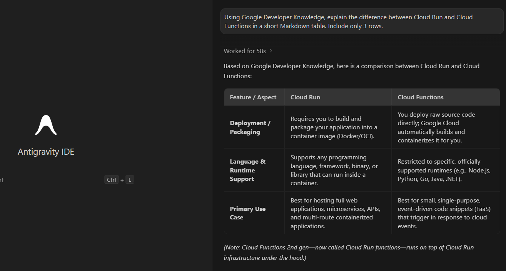
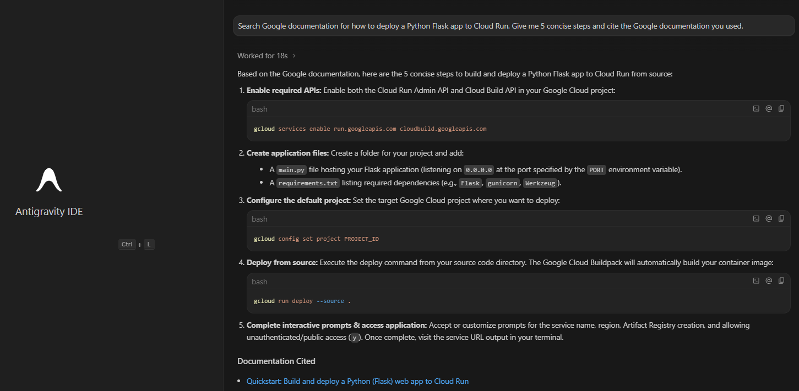

# 💬 Prompts and Results — Developer Knowledge MCP Codelab

This file records the visible validation prompts used after the Google Developer Knowledge MCP server was configured in Antigravity.

The goal was not to collect many prompts. The goal was to prove that the MCP server was available, that Antigravity asked for permission before tool use, and that the responses could be grounded in Google developer documentation.

---

## 🧪 Test summary

| # | Prompt focus | MCP behavior observed | Result |
|---|---|---|---|
| 1 | Google Workspace MCP support | Antigravity requested permission to call `google-developer-knowledge/search_documents`. | Successful answer with Google documentation references. |
| 2 | Google Workspace and Cloud Run API names | Antigravity requested another documentation search. | Successful concise list of relevant APIs and Cloud Run API naming details. |
| 3 | Cloud Run vs Cloud Functions | Developer Knowledge search was used to support a comparison answer. | Successful short Markdown table comparing both services. |
| 4 | Python Flask deployment to Cloud Run | Developer Knowledge search returned Cloud Run deployment guidance. | Successful concise deployment steps with a Google documentation reference. |

---

## 1) Google Workspace MCP server support

### Purpose

Check whether the Developer Knowledge MCP server could answer a product/documentation question about Google Workspace MCP support.

### Prompt focus

```text
Does Google Workspace have MCP server support?
```

### Evidence




### Result

Antigravity asked for permission before using `google-developer-knowledge/search_documents`. After approval, it returned a successful answer that referenced Google documentation related to Google Workspace MCP server support.

### What this validated

This was the first proof that the MCP connection was active in practice. The server was not only visible in settings; it was being called during the conversation.

---

## 2) Workspace and Cloud Run API names

### Purpose

Test whether the MCP setup could retrieve more concrete API/product naming information instead of only answering a broad conceptual question.

### Prompt focus

```text
Find the Google Workspace MCP server API name and the Cloud Run API name from Google documentation.
```

### Evidence





### Result

Antigravity again requested permission for the documentation search. The final answer summarized Google Workspace APIs and Cloud Run API naming details in a compact way.

### What this validated

This test showed that the MCP server could support more specific technical lookup tasks, not only broad explanation prompts.

---

## 3) Cloud Run vs Cloud Functions comparison

### Purpose

Check whether the MCP-backed workflow could support a comparison-style answer in a clean Markdown format.

### Prompt focus

```text
Compare Cloud Run and Cloud Functions in a short Markdown table.
```

### Evidence



### Result

Antigravity returned a short Markdown table comparing the two services across practical categories such as use case, execution model, scaling behavior, and developer control.

### What this validated

This showed that the Developer Knowledge MCP workflow can support synthesis, not only raw search snippets. The agent still needed to organize the answer, but the retrieval path helped ground the comparison in official Google documentation.

---

## 4) Python Flask deployment to Cloud Run

### Purpose

Connect the MCP validation to a realistic deployment question from the course context.

Earlier work in this portfolio involved Flask apps and Cloud Run/Render-style deployment thinking, so this was a useful practical test.

### Prompt focus

```text
Search Google documentation and give me five concise steps to deploy a Python Flask app to Cloud Run.
```

### Evidence



### Result

Antigravity returned a concise five-step deployment sequence and referenced the Cloud Run Python quickstart/documentation.

### What this validated

This was the most practical validation prompt in the set. It showed that the MCP connection can help with task-oriented developer guidance, not only factual lookup.

---

## 🧠 What I noticed during testing

A few things stood out while testing the MCP server:

- permission prompts made the external tool boundary visible,
- focused prompts worked better than broad research-style prompts,
- the MCP flow was most useful when asking for official product details or implementation guidance,
- the answers still needed human review, especially when comparing services,
- and screenshots should capture both the permission moment and the final answer whenever possible.

This is why I preserved both permission screenshots and result screenshots. Together, they show the full chain: request, approval, tool call, and answer.

---

## ✅ Final validation note

The Google Developer Knowledge MCP setup was considered successful because:

```text
MCP server visible in Antigravity: yes
Developer Knowledge tools visible: yes
Tool permission prompt observed: yes
search_documents used: yes
Documentation-backed answers returned: yes
API key committed publicly: no
```
