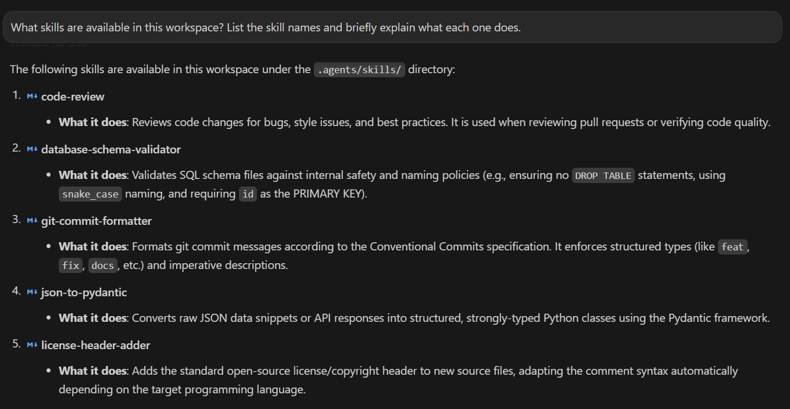
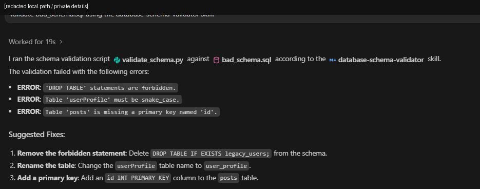
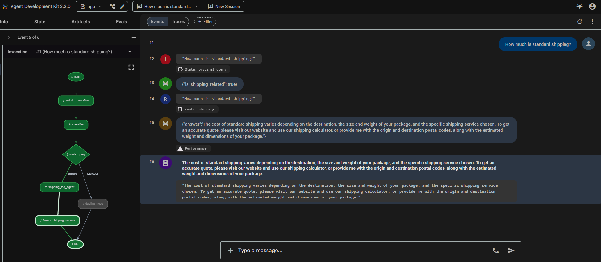
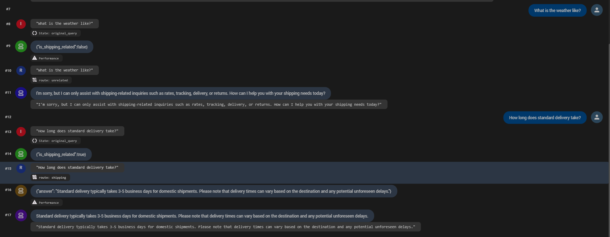
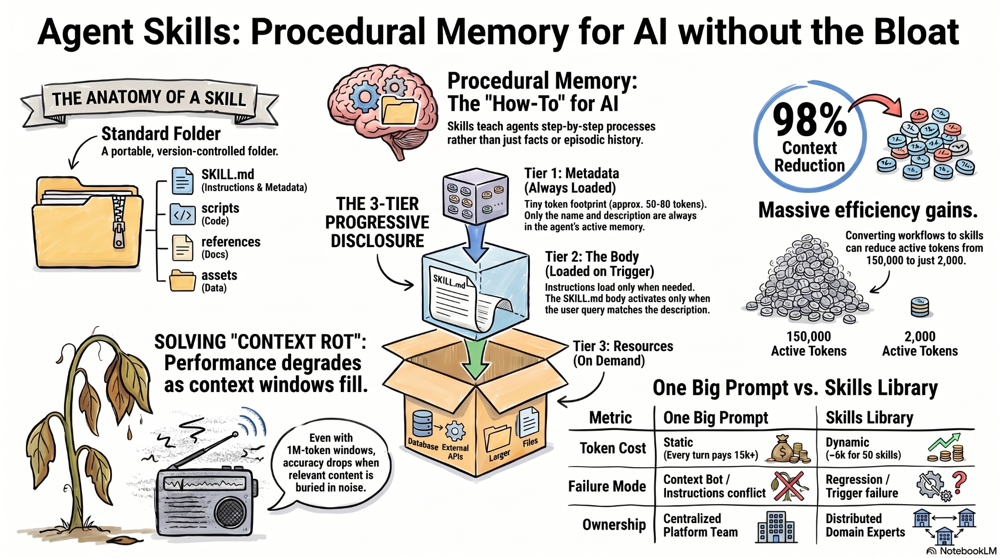

# 🧠 Day 3 - Agent Skills & Procedural Memory

This folder documents my work for **Unit 3: Agent Skills** from the Google/Kaggle 5-Day AI Agents Intensive Vibe Coding Course.

Day 2 focused on how agents connect outward to tools, documentation sources, APIs, and protocols such as MCP. Day 3 shifted the focus inward:

> How can an agent carry reusable know-how without loading every instruction, workflow, and reference into the active context window every time?

The answer from this unit is **Agent Skills**: portable folders that package reusable procedures, scripts, examples, and reference material. Instead of making the model carry everything in one giant prompt, skills let the agent keep lightweight routing metadata available and load the full procedure only when the task actually needs it.

This Day 3 folder now includes the theory work, visual study assets, and both completed hands-on codelabs.

---

## 📌 Current status

| Area | Status | Notes |
|---|---|---|
| Unit 3 podcast | ✅ Completed | Reviewed the Unit 3 podcast/video and converted the main ideas into human-readable notes. |
| Agent Skills whitepaper | ✅ Completed | Read and revised using structured notes, key-concept review, and NotebookLM study prompts. |
| NotebookLM study work | ✅ Completed | Used for Q&A, quiz-style recall, glossary checks, and explanation review. |
| Infographics | ✅ Completed | Added two visual summaries for quick revision. |
| Antigravity Skills codelab | ✅ Completed | Installed, inspected, and tested workspace skills; validated `SKILL.md`, resources, examples, and script-backed skill behavior. |
| Agents CLI + ADK lifecycle codelab | ✅ Completed | Built and tested a graph workflow customer-support agent with ADK 2.0, Gemini API-key mode, playground traces, hot-restart validation, and CLI execution. |

The practical work is now finished. Day 3 is no longer only a theory folder; it contains working codelab evidence, curated source snapshots, command notes, testing records, and troubleshooting notes.

---

## 🧪 Hands-on Codelab 1 update

The first Day 3 codelab focused on **authoring and using Google Antigravity Skills**.

📂 Codelab folder: [`codelabs/01-antigravity-skills/`](./codelabs/01-antigravity-skills/)

The workflow started with a clean environment audit inside Antigravity IDE, then moved through the official sample skills:

- `git-commit-formatter`
- `license-header-adder`
- `database-schema-validator`
- `json-to-pydantic`

The main lesson was that a skill is not just a saved prompt. A useful skill behaves more like a small procedural package:

```text
SKILL.md        -> metadata, routing description, and main instructions
scripts/        -> deterministic helper code
resources/      -> templates or reusable files
examples/       -> examples that guide output shape
```

### Evidence snapshot





This codelab made the whitepaper idea concrete. The `description` field in `SKILL.md` acted as the routing surface, while supporting files such as `scripts/`, `resources/`, and `examples/` gave the agent more reliable procedures than plain text alone.

The final part of the codelab installed the seven `google-agents-cli-*` skills and scaffolded a weather assistant prototype. The local ADK server and graph worked, but a live Vertex-backed model call was blocked because billing was disabled on the active Google Cloud project. I kept that as a documented environment limitation instead of hiding it.

---

## 🧭 Hands-on Codelab 2 update

The second Day 3 codelab focused on **Agents CLI + ADK 2.0 lifecycle**.

📂 Codelab folder: [`codelabs/02-agents-cli-adk-lifecycle/`](./codelabs/02-agents-cli-adk-lifecycle/)

The final project is a graph workflow agent called **customer-support-agent**.

It classifies incoming questions as shipping-related or unrelated, routes shipping questions to a shipping FAQ agent, and politely declines unrelated questions.

```text
START
  ↓
initialize_workflow
  ↓
classifier
  ↓
route_query
  ├── shipping -> shipping_faq_agent -> format_shipping_answer -> END
  └── default  -> decline_node -> END
```

### Evidence snapshot





This codelab turned the procedural-memory idea into a working agent lifecycle: scaffold, inspect, patch, lint, import, launch playground, validate routes, change response style, restart, and execute a CLI query against the running ADK endpoint.

One important engineering decision was to use **Gemini API-key local mode** for the customer-support agent. That avoided the Cloud billing blocker encountered in the Codelab 1 weather prototype and kept the local development loop focused on the ADK workflow itself.

---

## 🖼️ Visual summary

The first infographic helped me connect the main architecture idea: Agent Skills act like procedural memory, with `SKILL.md`, optional scripts, references, and assets organized as a portable folder.



The second infographic gave me a cleaner beginner mental model: metadata is always available, the skill body loads on trigger, and resources stay outside the active context until needed.


---

## 🧠 Main learning summary

The biggest lesson from Day 3 is that **more context is not always more intelligence**.

Before this unit, it was tempting to think that very large context windows could solve most agent memory problems. Just add every SOP, runbook, coding rule, compliance policy, and product rule into the prompt. The whitepaper challenged that instinct. Large context can create **context rot**, where important instructions are technically present but buried inside noise.

Agent Skills solve the problem by changing the loading pattern.

```text
One giant prompt:
Everything is loaded every time, even when most of it is irrelevant.

Skills library:
Only metadata is always visible.
The full instructions load only when the task triggers that skill.
Supporting files stay outside the token window until needed.
```

My working mental model:

| Memory type | How I understand it |
|---|---|
| Semantic memory | The model's general knowledge and learned patterns. |
| Episodic memory | Conversation history and what happened earlier in the current workflow. |
| Procedural memory | Reusable know-how for how to perform a task. |
| Agent Skill | A portable procedural-memory package the agent can discover and load on demand. |

---

## 📁 Folder contents

| File / Folder | Purpose |
|---|---|
| [`notes/day-3-podcast-whitepaper-notes.md`](./notes/day-3-podcast-whitepaper-notes.md) | Combined notes from the Unit 3 podcast and Agent Skills whitepaper. |
| [`notes/day-3-key-concepts.md`](./notes/day-3-key-concepts.md) | Compact glossary for revision before and after codelabs. |
| [`notes/day-3-study-guide-summary.md`](./notes/day-3-study-guide-summary.md) | Study process and recall questions from the theory phase. |
| [`notes/day-3-codelab-1-antigravity-skills.md`](./notes/day-3-codelab-1-antigravity-skills.md) | Practical notes from the Antigravity Skills codelab. |
| [`notes/day-3-codelab-2-agents-cli-adk.md`](./notes/day-3-codelab-2-agents-cli-adk.md) | Practical notes from the Agents CLI + ADK lifecycle codelab. |
| [`codelabs/`](./codelabs/) | Completed hands-on codelab documentation, commands, validation notes, source snapshots, and troubleshooting notes. |
| [`screenshots/`](./screenshots/) | Renamed screenshot evidence from both Day 3 codelabs. |
| [`assets/infographics/`](./assets/infographics/) | Visual study assets generated during the theory phase. |
| [`resources/day-3-links.md`](./resources/day-3-links.md) | Official course, codelab, and reference links. |
| [`resources/commands-index.md`](./resources/commands-index.md) | Index of command logs kept inside the codelab folders. |
| [`reflections/day-3-reflection.md`](./reflections/day-3-reflection.md) | Personal reflection on what changed after doing the codelabs. |

---

## 🧩 What clicked after the codelabs

The theory made skills sound like a context-management idea. The codelabs showed that they are also an engineering practice.

A skill needs the same discipline as any small reusable module:

- a clear name,
- a precise trigger description,
- testable instructions,
- supporting files only where they add value,
- deterministic scripts for checks that should not depend on model judgment,
- and enough evidence to prove the skill actually routed and worked.

The ADK lifecycle codelab added the second half of the picture. Once a skill or agent workflow becomes executable, documentation has to capture more than the happy path. It should show setup, failures, fixes, routing behavior, runtime mode, local testing, and final validation.

---

## 🛡️ Safety notes I want to remember

Day 3 also reinforced a practical security habit: agent workflows touch local files, credentials, project config, and sometimes cloud APIs. That means the repo should record the work without exposing the environment.

Rules I followed while organizing this folder:

- no API keys committed,
- no `.env` files committed,
- no virtual environments committed,
- no local ADK session databases committed,
- no Google Cloud credential files committed,
- no raw account screenshots committed without redaction,
- billing and auth blockers documented as environment issues, not hidden as if the code succeeded silently.

---

## ✅ Current takeaway

Day 3 made Agent Skills feel less like a feature checkbox and more like a design pattern for procedural memory. A good skill reduces context pressure, narrows the agent's attention, and packages repeatable know-how in a form that can be inspected, tested, and reused.

The two codelabs connected that idea to real work: first through Antigravity skill packages, then through an ADK graph workflow agent that routed user requests, exposed traces, and ran from both the playground and command line.
