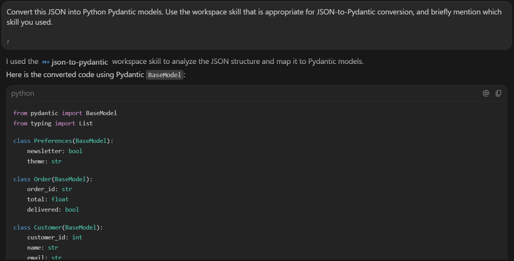
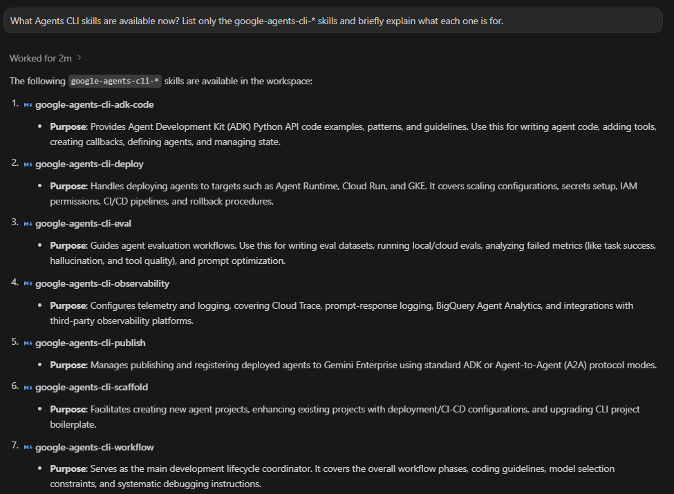

# 🧠 Codelab 1 - Authoring / Exploring Google Antigravity Skills

This codelab documents the Day 3 hands-on work for **Google Antigravity Skills**.

The goal was to move from the whitepaper idea of procedural memory into a real Antigravity workspace: install skills, inspect their structure, trigger them through natural-language tasks, and verify that they actually changed agent behavior.

---

## ✅ Completion status

| Area | Status | Evidence |
|---|---|---|
| Environment audit | ✅ Completed | Python, Node, uv, Git, Antigravity workspace, and skill folders checked. |
| Workspace skill path | ✅ Completed | Project skills verified under `.agents/skills/`. |
| Official sample skills copied | ✅ Completed | Four tutorial skills copied into the workspace. |
| Skill discovery in Antigravity | ✅ Completed | Antigravity listed the workspace skills and explained each one. |
| `SKILL.md` inspection | ✅ Completed | YAML frontmatter, `name`, `description`, and Markdown instructions reviewed. |
| Git commit formatter test | ✅ Completed | Conventional Commit messages generated for `git_test`. |
| License header test | ✅ Completed | `my_script.py` received the expected Apache-style header. |
| JSON to Pydantic test | ✅ Completed | `product.json` converted into `product_model.py`. |
| Database schema validator test | ✅ Completed | SQL policy violations caught by the script-backed skill. |
| Agents CLI skills setup | ✅ Completed | Seven `google-agents-cli-*` skills installed and visible. |
| Weather assistant prototype | ✅ Completed with limitation | Scaffold and ADK graph worked; live Vertex model call was blocked by Cloud billing. |

---

## 🧩 What this codelab was really testing

The codelab was not only testing whether Antigravity could read a folder. It was testing whether a skill package can give an agent reusable, task-specific behavior without stuffing every instruction into the main conversation.

The key structure was simple:

```text
skill-name/
├── SKILL.md      # required: metadata + instructions
├── scripts/      # optional: deterministic helper code
├── resources/    # optional: reusable templates or files
└── examples/     # optional: few-shot examples or output patterns
```

The most important routing field was the `description` in `SKILL.md`. A weak description makes the skill invisible or over-eager. A precise description gives the agent a better trigger surface.

---

## 🛠️ Skills installed and tested

| Skill | What I tested | Result |
|---|---|---|
| `git-commit-formatter` | Asked Antigravity to stage and commit changes in a test repo. | Commit messages followed Conventional Commits, such as `feat(auth): add google login function`. |
| `license-header-adder` | Created `my_script.py`. | The file received an Apache-style header converted into Python `#` comments. |
| `json-to-pydantic` | Converted `product.json` into `product_model.py`. | Pydantic model generated with `Optional[int]` for the nullable field. |
| `database-schema-validator` | Validated `bad_schema.sql`. | The script caught `DROP TABLE`, non-snake-case table naming, and missing `id` primary key. |

---

## 📸 Evidence snapshots

### Workspace skills detected

Antigravity recognized the local project skills under `.agents/skills/` and described each one.


### JSON to Pydantic conversion

The `json-to-pydantic` skill produced a structured model from a small JSON file.



### Script-backed schema validation

The database validator did not rely on a visual inspection. It ran a helper script and returned deterministic errors.


### Agents CLI skills installed

The Agents CLI setup installed seven additional skills for ADK workflows, deployment, evaluation, observability, publishing, scaffolding, and workflow guidance.



---

## 🧪 Validation highlights

The most useful validation was not a single success screenshot. It was the mix of agent responses and terminal checks.

Examples:

```powershell
Get-ChildItem .agents/skills -Directory
Get-Content .agents/skills/json-to-pydantic/SKILL.md -TotalCount 25
python .agents/skills/database-schema-validator/scripts/validate_schema.py bad_schema.sql
agents-cli --version
Get-ChildItem ~/.agents/skills -Directory
```

The schema validator was especially important because it showed the value of scripts inside skills. Naming and safety rules are easy for a model to miss by eye; a script made the check repeatable.

---

## ⚠️ Weather assistant limitation

The Agents CLI part of the codelab generated a `weather-assistant` prototype and installed its dependencies. The ADK web server and graph loaded correctly, showing a `root_agent` with weather and time tools.

The live model call failed because the generated prototype used Vertex/Agent Platform mode, and the active Google Cloud project did not have billing enabled. I treated that as an environment limitation rather than rewriting the prototype just to hide the failure.

What worked:

- `agents-cli` installation,
- seven Agents CLI skills installation,
- project scaffold generation,
- dependency sync,
- ADK web server startup,
- graph rendering in the ADK UI.

What was blocked:

- live Vertex-backed model response due to Cloud billing.

The codelab still achieved its learning target: I verified how Agents CLI skills install and how an ADK scaffold appears in a local playground.

---

## 📂 Source and evidence kept

| Path | Purpose |
|---|---|
| [`source/workspace-skills/`](./source/workspace-skills/) | Curated copy of the skill packages used during testing. |
| [`source/skill-test-artifacts/`](./source/skill-test-artifacts/) | Small files created while testing the skills: SQL, JSON, Python, and Pydantic output. |
| [`source/weather-assistant-minimal/`](./source/weather-assistant-minimal/) | Minimal scaffold snapshot from the Agents CLI prototype, with local noise removed. |
| [`commands-used.md`](./commands-used.md) | Commands run during setup, copying, inspection, validation, and Agents CLI setup. |
| [`testing-and-validation.md`](./testing-and-validation.md) | Practical test cases and outcomes. |
| [`observations.md`](./observations.md) | Notes on what worked, what failed, and what I learned from the codelab. |

---

## ✅ Takeaway

This codelab made Agent Skills feel like small, reusable engineering assets. The strongest skill packages were the ones with clear trigger descriptions and concrete supporting files. The weak point was not the concept; it was environment setup around cloud-backed agent execution, which needs separate billing/auth planning.
