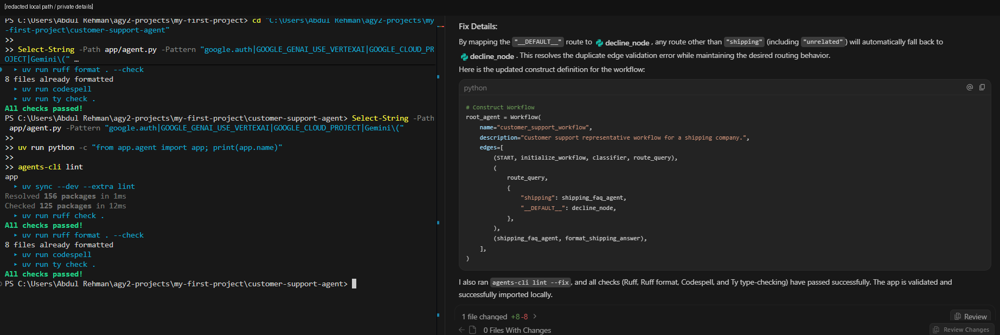
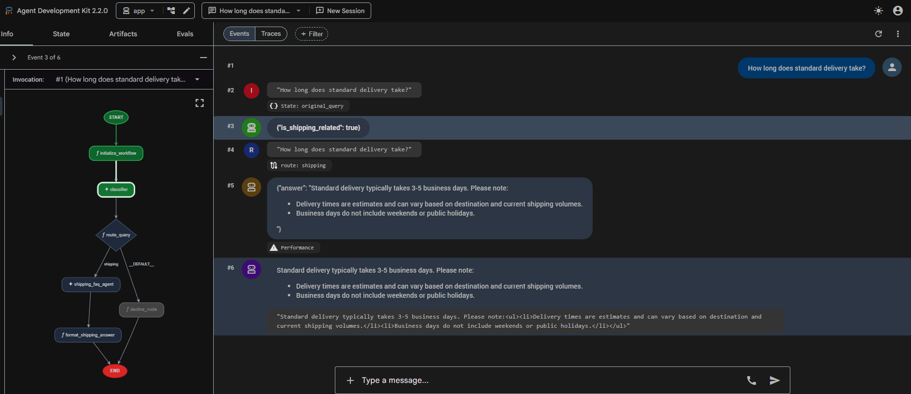
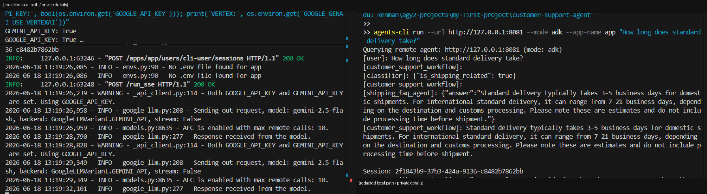

# 🧭 Codelab 2 - Agents CLI + ADK Lifecycle

This codelab documents the Day 3 hands-on work for **Agents CLI and ADK 2.0 lifecycle management**.

The goal was to create a graph workflow agent, inspect the generated project, fix runtime issues, validate routing, and run the agent from both the ADK playground and the command line.

The final project is called **customer-support-agent**.

---

## ✅ Completion status

| Area | Status | Evidence |
|---|---|---|
| Authentication mode | ✅ Completed | Switched to local Gemini API-key mode to avoid Cloud billing blockers. |
| Project scaffold | ✅ Completed | `customer-support-agent` generated with Agents CLI prototype mode. |
| ADK graph workflow | ✅ Completed | Workflow includes initialization, classifier, router, shipping FAQ node, decline node, and formatter. |
| Code inspection | ✅ Completed | `app/agent.py` reviewed and patched for correct local runtime behavior. |
| Route-map fix | ✅ Completed | Replaced invalid 3-tuple branch edges with ADK route-map syntax. |
| Linting | ✅ Completed | `agents-cli lint` passed after fixes. |
| Runtime import | ✅ Completed | `from app.agent import app` returned `app`. |
| Playground testing | ✅ Completed | Shipping and unrelated prompts routed correctly. |
| Response-style iteration | ✅ Completed | Shipping FAQ response changed to concise bullet style and retested. |
| Command-line execution | ✅ Completed | `agents-cli run --url ... --mode adk --app-name app` queried the running ADK endpoint successfully. |

---

## 🧱 Final workflow design

The codelab agent acts as a shipping-company customer support representative. It does not answer every question. It first classifies the request, then routes it.

```text
START
  ↓
initialize_workflow
  ↓
classifier
  ↓
route_query
  ├── shipping -> shipping_faq_agent -> format_shipping_answer -> END
  └── default  -> decline_node -> END
```

### Main components

| Component | Role |
|---|---|
| `initialize_workflow` | Extracts the user query and stores it in workflow state. |
| `classifier` | Uses Gemini to classify whether the query is shipping-related. |
| `route_query` | Converts the classifier output into a workflow route. |
| `shipping_faq_agent` | Answers shipping questions about rates, tracking, delivery, and returns. |
| `decline_node` | Politely declines unrelated questions. |
| `format_shipping_answer` | Converts structured FAQ output into final model content. |

---

## 🔧 Important fixes made during the codelab

### 1. Switched away from forced Vertex mode

The generated code initially used Google Cloud ADC and forced Vertex mode. That repeated the same billing path that blocked the weather assistant in Codelab 1.

For this local codelab, I removed the forced Vertex setup and used environment variables for Gemini API-key mode instead:

```text
GEMINI_API_KEY=True
GOOGLE_API_KEY=True
GOOGLE_GENAI_USE_VERTEXAI=False
```

The API key itself is not committed.

### 2. Fixed the workflow route-map syntax

The first branch definition used separate 3-tuples for routed edges. That passed formatting checks but failed ADK validation. I changed the workflow to use a route-map dictionary:

```python
edges=[
    (START, initialize_workflow, classifier, route_query),
    (
        route_query,
        {
            "shipping": shipping_faq_agent,
            "__DEFAULT__": decline_node,
        },
    ),
    (shipping_faq_agent, format_shipping_answer),
]
```

That fixed the runtime graph validation issue.

### 3. Used `agents-cli run --url` for CLI execution

On Windows, the plain `agents-cli run "..."` command timed out while starting its own local server. Since the ADK server was already working, I used the documented remote endpoint mode:

```powershell
agents-cli run --url http://127.0.0.1:8081 --mode adk --app-name app "How long does standard delivery take?"
```

That completed the command-line execution step without reintroducing the server startup issue.

---

## 📸 Evidence snapshots

### Route-map fix and lint pass



### Shipping query route

The shipping-rate question was classified as shipping-related, routed to `shipping_faq_agent`, and answered by the FAQ path.


### Shipping + unrelated route tests

The weather question was classified as unrelated and declined. The delivery question routed back through the shipping FAQ path.


### Response-style update

After changing the shipping FAQ instruction, the delivery-time answer became shorter and used bullets.



### Command-line run through Agents CLI

The final CLI query ran against the working ADK endpoint and returned the customer-support workflow response.



---

## 📂 Source and evidence kept

| Path | Purpose |
|---|---|
| [`source/customer-support-agent/`](./source/customer-support-agent/) | Curated source snapshot of the final ADK graph workflow agent. |
| [`commands-used.md`](./commands-used.md) | Commands used for setup, validation, playground, and CLI execution. |
| [`testing-and-validation.md`](./testing-and-validation.md) | Test prompts, expected behavior, and actual outcomes. |
| [`troubleshooting-notes.md`](./troubleshooting-notes.md) | Notes on auth mode, route-map validation, Windows reload behavior, and CLI server timeout. |

---

## ✅ Takeaway

This codelab made the lifecycle part of agent development much clearer. Scaffolding is only the first step. A useful agent project still needs code review, auth-mode alignment, graph validation, linting, trace inspection, prompt testing, iteration, and a final command-line proof.
