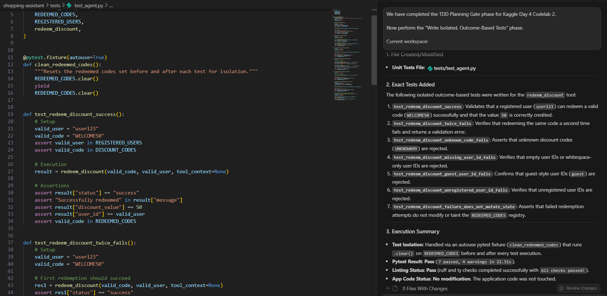
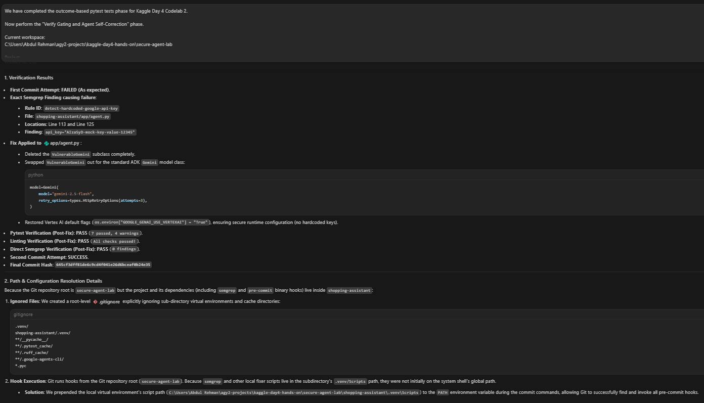
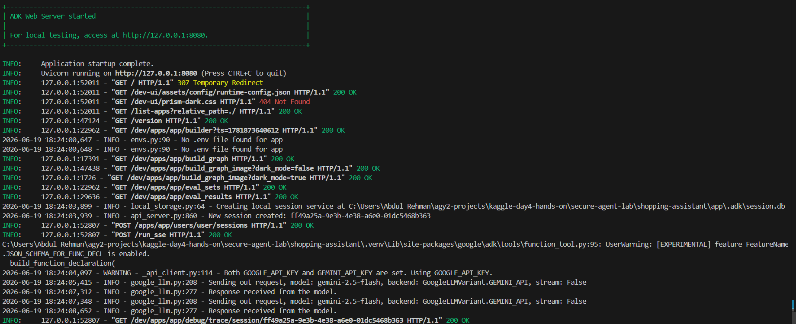

# 🔐 Codelab 2 - Secure Agent Lifecycle with Antigravity and TDD

This codelab built a local **ADK shopping assistant** and then wrapped it in a secure development lifecycle.

The application itself is intentionally small: an agent can redeem discount codes for registered users. The value of the codelab is the security workflow around that code: project rules, local gates, command hooks, threat modeling, tests, and pre-commit remediation.

---

## 🎯 What I built

The final source snapshot is preserved in [`source/shopping-assistant/`](./source/shopping-assistant/).

The agent exposes a `redeem_discount` tool with these business rules:

| Rule | Behavior |
|---|---|
| Valid codes | `WELCOME50` and `SUMMER20` are accepted if unused. |
| Single-use redemption | A code is added to `REDEEMED_CODES` after successful redemption. |
| Registered users only | Valid users include `user123`, `user_abc`, `alice`, `bob`, and `customer_01`. |
| Missing or guest users | Rejected before redemption. |
| Unknown codes | Rejected without mutating state. |

The final local Playground proof used:

```text
Can you redeem the discount code WELCOME50 for user user123?
```

and the agent called `redeem_discount` successfully.


---

## 🏗️ Secure lifecycle architecture

The codelab did not stop at writing a tool. It built a layered local lifecycle:

```text
.agents/CONTEXT.md
  -> secure coding standards and planning rules

.semgrep/rules.yaml
  -> local secret-shaped string detection

.pre-commit-config.yaml
  -> mandatory scan before commit

.agents/hooks.json + validate_tool_call.py
  -> Antigravity run_command guard

.agents/skills/stride-threat-model/SKILL.md
  -> reusable STRIDE review workflow

tests/test_agent.py
  -> outcome-based validation of tool behavior
```

This chain makes the agent project harder to accidentally weaken. Different gates catch different problems.

---

## 🧱 Project-specific rules

`.agents/CONTEXT.md` acted as the project’s secure coding memory. It defined the local “paved roads”:

- validate tool inputs,
- avoid raw shell execution unless approved by hooks,
- treat failed pre-commit checks as remediation work,
- never commit real secrets,
- prefer outcome-based tests,
- keep tools least-privilege,
- require security boundaries in implementation plans.


---

## 🔎 STRIDE threat model

The local `stride-threat-model` skill generated a structured `threat_model.md` for the shopping assistant.

Top risks identified:

1. hardcoded mock API-key-shaped value during the demonstration phase,
2. spoofable `user_id` parameter,
3. global in-memory redemption state,
4. limited audit logging,
5. no rate limiting around tool execution.

The mock key risk was later remediated during the pre-commit self-correction step. I kept the threat model as evidence of what the system looked like before remediation.


---

## 🧪 Outcome-based tests

The test suite validated behavior rather than internal implementation shape.

Tests covered:

- successful redemption for a registered user,
- duplicate redemption failure,
- unknown code rejection,
- missing user rejection,
- guest user rejection,
- unregistered user rejection,
- no state mutation after failed redemptions.



Final result:

```text
7 passed
```

---

## 🧯 Pre-commit failure and remediation

The codelab intentionally introduced a mock Google API-key-shaped value to prove the local gate worked.

The first commit failed as expected:

```text
Rule ID: detect-hardcoded-google-api-key
Finding: api_key="AIzaSyD-mock-key-value-12345"
```

Then the code was refactored:

- removed the `VulnerableGemini` class,
- removed all literal mock key occurrences,
- restored standard `Gemini(model="gemini-2.5-flash", ...)` initialization,
- used environment-based authentication instead of source-code credentials,
- reran tests, lint, and Semgrep,
- committed without `--no-verify`.



---

## 🔑 Auth issue and final fix

The first local Playground run routed through Vertex AI Application Default Credentials and failed with a billing-required permission error.

The fix was not to enable billing or hardcode a key. The local development path was updated to use Google AI Studio / Gemini API environment authentication:

```python
# Local developer authentication should use GEMINI_API_KEY from environment, not source code.
os.environ.setdefault("GOOGLE_GENAI_USE_VERTEXAI", "False")
```

Final terminal evidence showed the Gemini API backend receiving model responses.



---

## ✅ Final validation summary

| Check | Result |
|---|---|
| `uv run pytest tests/test_agent.py` | ✅ 7 passed |
| `agents-cli lint` | ✅ Passed |
| Direct Semgrep after remediation | ✅ 0 findings |
| Safe validator payload | ✅ Approved |
| Destructive validator payload | ✅ Blocked |
| First pre-commit attempt | ✅ Failed intentionally on mock key |
| Secure commit | ✅ Succeeded |
| AI Studio auth-routing commit | ✅ Succeeded |
| Local ADK Playground | ✅ Redeemed `WELCOME50` for `user123` |

Key commits:

```text
645cf3dff81de6c9cd4f041e26d6bceaf0b24e35  feat: implement shopping assistant agent
427bc1fd873bff790fc57b3e386e6ea542150f5b  chore: support AI Studio API key auth
```

---

## 📁 Codelab folder guide

| File / Folder | Purpose |
|---|---|
| [`commands-used.md`](./commands-used.md) | Main commands for setup, security gates, tests, commits, and local playground. |
| [`testing-and-validation.md`](./testing-and-validation.md) | Evidence for pytest, lint, Semgrep, validator tests, and Playground behavior. |
| [`security-controls.md`](./security-controls.md) | Explanation of each local control and what risk it reduces. |
| [`troubleshooting-notes.md`](./troubleshooting-notes.md) | Notes about Git-root path issues, Windows shell behavior, and auth routing. |
| [`evidence-log.md`](./evidence-log.md) | Timeline-style evidence log for the codelab. |
| [`artifacts/`](./artifacts/) | Codelab evidence markdown, task checklist, walkthrough, threat model, and planning artifact. |
| [`source/shopping-assistant/`](./source/shopping-assistant/) | Cleaned source snapshot, including the full generated Terraform deployment scaffold as evidence. |

---

## 🧠 What I learned

This codelab made secure agent development feel like a real engineering loop.

A single rule would not have been enough. The useful pattern was layered:

```text
Tell the agent the project rules.
Block dangerous commands before they run.
Scan for secret-shaped mistakes before commit.
Force remediation instead of bypass.
Write tests around outcomes.
Generate a threat model before extending the system.
Run the agent locally and inspect the actual tool call.
```

That is the kind of workflow I want to keep using when agentic coding moves from toy examples into security-sensitive applications.
